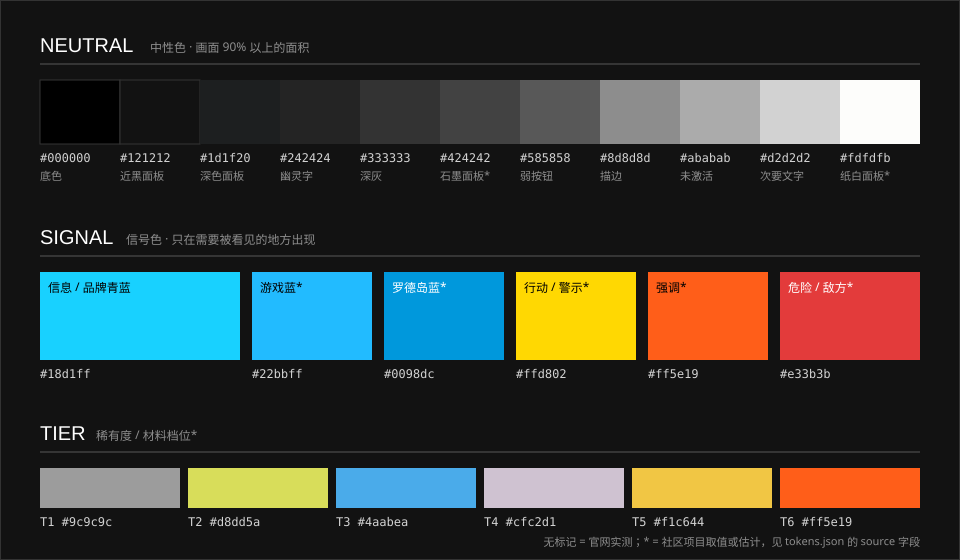
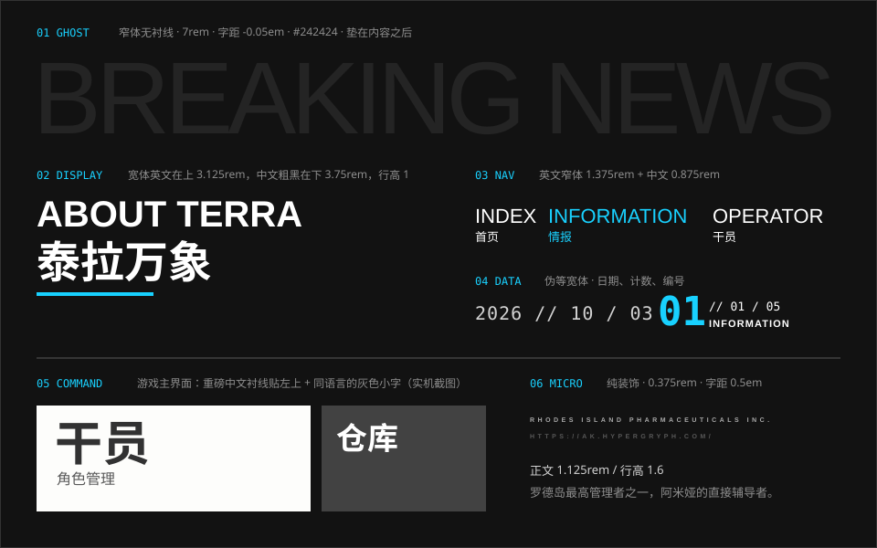

# arknights-ui

《明日方舟》设计风格指导文档：调研官网、游戏界面、宣传物料与社区开源项目，整理成一套按模块细分的设计规范，并附可直接使用的 Design Tokens，以及按这套规范实现的 React 组件库。

> **非官方项目。** 本仓库是玩家出于学习目的做的风格研究，与上海鹰角网络科技有限公司无关。《明日方舟》及其 Logo、立绘、界面、字体等素材的版权归鹰角网络及相应权利人所有。本仓库不存放任何官方素材：官方图片一律以外链引用，示意图全部为自绘 SVG。

[](https://github.com/icaruszezen/arknights-ui/actions/workflows/ci.yml) **在线预览：[组件示例（Storybook）](https://icaruszezen.github.io/arknights-ui/)**

## 速览





**一句话：** 工业终端的骨架，国际主义的版式。黑白灰打底，一个信号色点睛；直角矩形拼合，细线分区；中英成对，数字说话。

| | |
| --- | --- |
| 颜色 | 九成黑白灰 + 一个信号色（官网为青蓝 `#18d1ff`） |
| 形状 | 直角矩形；强调时切一个角；全局只用 45° |
| 字体 | 窄体英文（Oswald）+ 宽体英文（Novecento Sans Wide）+ 数据体（Bender）+ 思源黑体 / 宋体 |
| 排版 | 中英成对、一主一辅；标题行高 1；数字大而带分母 |
| 底纹 | 半调网点、噪点、警戒条纹窄边、斜线网格 |
| 图片 | 立绘出血、背景巨字、只压文字一侧的黑色渐变 |
| 动效 | 默认 300ms，悬停整块换色，入场有先后 |

完整说明见 [设计总纲](docs/00-overview.md)。

## 文档

从 **[设计总纲](docs/00-overview.md)** 开始。

### 基础规范

| 文档 | 内容 |
| --- | --- |
| [色彩](docs/foundations/color.md) | 中性色、信号色、稀有度色、面积配比 |
| [字体与排版](docs/foundations/typography.md) | 字体角色、字号阶、字距、中英混排、字体授权 |
| [布局与层级](docs/foundations/layout-and-depth.md) | 固定骨架、不对称分栏、透视、毛玻璃、响应式 |
| [几何语言](docs/foundations/geometry.md) | 矩形、切角、斜轴、三角母题、细线 |
| [底纹](docs/foundations/texture-and-pattern.md) | 半调、噪点、警戒条纹、网格、故障 |
| [图标与符号](docs/foundations/iconography.md) | 单色几何图标、阵营标识、虚构品牌 |
| [图片](docs/foundations/imagery.md) | 出血、重影、遮罩、焦距、裁切 |
| [动效](docs/foundations/motion.md) | 时长、缓动、编排、无障碍 |

### 通用元素

| 文档 | 内容 |
| --- | --- |
| [按钮](docs/elements/buttons.md) | 三个层级、双语两行、悬停对调 |
| [面板与卡片](docs/elements/panels-and-cards.md) | 纸白 / 石墨 / 毛玻璃、抽屉、层级 |
| [导航](docs/elements/navigation.md) | 双语顶栏、返回 + 主页、标签页 |
| [数据展示](docs/elements/data-display.md) | 数值、列表行、进度、标签、星级 |
| [反馈](docs/elements/feedback.md) | 弹窗、提示、加载、空状态 |
| [装饰元素](docs/elements/decorations.md) | 编号、日期写法、微缩英文、角标、标注 |

### 场景模块

| 文档 | 内容 |
| --- | --- |
| [官网](docs/modules/website.md) | 六屏结构、固定骨架、实测数值 |
| [游戏 · 主界面](docs/modules/game/home.md) | 画内界面、透视面板组 |
| [游戏 · 干员](docs/modules/game/operator.md) | 列表、详情、不离开画布的养成 |
| [游戏 · 作战](docs/modules/game/battle.md) | 关卡地图、作战 HUD |
| [游戏 · 基建](docs/modules/game/base.md) | 剖面视图、类型色、抽屉 |
| [游戏 · 寻访与采购中心](docs/modules/game/gacha-and-store.md) | 视差、仪式感、卡片 |
| [游戏 · 剧情](docs/modules/game/story.md) | 对话演出、章节标题字体 |
| [游戏 · 界面主题](docs/modules/game/themes.md) | 结构与表皮的分离 |
| [宣传物料](docs/modules/promotional.md) | 主视觉、公告图、虚构品牌、宣传片 |
| [衍生品牌](docs/modules/sub-brands.md) | 塞壬唱片、泰拉记事社、鹰角官网、森空岛 |

### 参考资料

| 文档 | 内容 |
| --- | --- |
| [开源项目盘点](docs/references/open-source.md) | GitHub 上的设计系统、界面复刻、主题、资源索引 |
| [分析文章索引](docs/references/articles.md) | UI/UX 分析、平面设计分析、维基、字体 |
| [官方图片外链索引](docs/references/image-index.md) | 按模块归类的官方图片入口；自绘示意图清单 |

## Design Tokens

[`tokens/tokens.json`](tokens/tokens.json) 是唯一数据源，[`tokens/tokens.css`](tokens/tokens.css) 由脚本生成，变量前缀为 `--ark-`。

```html
<link rel="stylesheet" href="tokens/tokens.css">
```

```css
.card {
  background: var(--ark-color-neutral-ink-900);
  color: var(--ark-color-neutral-white);
  border-left: var(--ark-line-strong) solid var(--ark-color-signal-info);
  font-family: var(--ark-font-family-cjk-sans);
  transition: background-color var(--ark-motion-duration-base);
}
```

覆盖范围：颜色（中性、信号、稀有度、遮罩、衍生品牌）、字体（字体栈、字号、字距、行高、字重）、间距、线宽、切角、圆角、阴影、模糊、透视、动效、底纹。

修改 token 后重新生成 CSS（需要 Node.js 18+，无其他依赖）：

```bash
node scripts/build-tokens.mjs
```

每个 token 带有 `source` 字段，标明数值的可信度。

### 配合 Tailwind CSS v4

脚本同时生成 [`tokens/tailwind.css`](tokens/tailwind.css)，把 token 映射成 Tailwind 的主题变量。键名统一带 `ark-` 前缀，不会覆盖 Tailwind 的默认主题。它的值都指向 `--ark-*` 变量，所以要和 `tokens.css` 一起引入：

```css
@import "tailwindcss";
@import "./tokens/tokens.css";
@import "./tokens/tailwind.css";
```

```html
<div class="bg-ark-neutral-ink-900 p-ark-5 font-ark-cjk-sans text-ark-neutral-white">
  <span class="font-ark-data text-ark-label tracking-ark-wide">NO.0147</span>
</div>
```

| token | 类名示例 |
| --- | --- |
| `color.*` | `bg-ark-signal-info`、`text-ark-neutral-gray-300`、`border-ark-line-hairline`、`bg-ark-tier-5` |
| `font.family.*` / `font.size.*` / `font.weight.*` | `font-ark-data`、`text-ark-label`、`font-ark-heavy` |
| `font.tracking.*` / `font.leading.*` | `tracking-ark-wide`、`leading-ark-solid` |
| `space.*` | `p-ark-5`、`gap-ark-2` |
| `shadow.*` / `blur.*` / `radius.*` | `drop-shadow-ark-panel`、`backdrop-blur-ark-backdrop`、`rounded-ark-subtle` |
| `motion.easing.*` | `ease-ark-mechanical` |

时长、线宽、切角、底纹没有对应的主题命名空间，在类名里用变量简写直接引用，例如 `duration-(--ark-motion-duration-base)`、`bg-(image:--ark-pattern-dash)`。

## React 组件库

[`packages/react`](packages/react) 是按这套规范实现的 React 组件库（`@arknights-ui/react`），用 Tailwind CSS v4 编写。[通用元素](#通用元素) 六篇文档里写到的东西都有对应的组件：

| 文档 | 组件 |
| --- | --- |
| 按钮 | `Button` · `ActionButton` |
| 面板与卡片 | `Panel` / `Card` · `Drawer` · `Sheet` |
| 导航 | `Nav` · `BackHome` · `QuickNav` · `ResourceBar` · `Tabs` |
| 数据展示 | `Stat` · `ListRow` · `Progress` · `RingProgress` · `Tag` · `Rating` · `Badge` |
| 反馈 | `Dialog` · `Notice` · `Loading` · `Empty` · `RewardGlow` |
| 装饰元素与排版 | `Heading` · `Divider` · `Counter` / `Serial` · `DateText` · `MicroText` · `GhostTitle` · `CornerMarks` · `Callout` · `Barcode` · `Ticks` |

本地预览（需要 Node.js 22.18+ 与 pnpm 10）：

```bash
pnpm install
```

```bash
pnpm storybook
```

组件不含任何官方素材，目前是工作区内的私有包，尚未发布到 npm。接入方式、约定和开发说明见 [packages/react/README.md](packages/react/README.md)。

### 持续集成与在线预览

[`.github/workflows/ci.yml`](.github/workflows/ci.yml) 在推送到 `main` 和提交 PR 时，依次执行 lint、类型检查、测试、组件库构建与 Storybook 构建；PR 只做验证。推送到 `main` 且全部通过后，把 Storybook 发布到 GitHub Pages：<https://icaruszezen.github.io/arknights-ui/>。

本地用 `pnpm build-storybook` 可以复现同样的构建，产物在 `packages/react/storybook-static`。

首次使用（包括 Fork 之后）需要在仓库的 **Settings → Pages → Build and deployment → Source** 里选 **GitHub Actions**，否则部署这一步会失败。

## 数值的可信度

| 标记 | 含义 |
| --- | --- |
| **实测**（`measured`） | 2026-10-06 从 [官方网站](https://ak.hypergryph.com/) 的样式表或计算样式中直接读出 |
| **社区**（`community`） | 来自开源项目或分析文章，非官方 |
| **估计**（`estimated`） | 根据截图与观察归纳，仅作起点 |

游戏内界面没有做过像素级测量，相关数值都是社区或估计。官网数值可信度最高。

## 仓库结构

```
README.md
docs/
  00-overview.md      设计总纲
  foundations/        基础规范（8 篇）
  elements/           通用元素（6 篇）
  modules/            场景模块（官网、游戏 7 篇、宣传物料、衍生品牌）
  references/         参考资料（3 篇）
  assets/             自绘 SVG 示意图（16 张）
tokens/
  tokens.json         Design Tokens 数据源
  tokens.css          生成的 CSS 变量
  tailwind.css        生成的 Tailwind CSS v4 主题映射
scripts/
  build-tokens.mjs    tokens.json → tokens.css + tailwind.css
packages/
  react/              React 组件库（@arknights-ui/react）
.github/
  workflows/ci.yml    构建、检查，并把 Storybook 发布到 GitHub Pages
package.json          pnpm 工作区（packages/* 与 tokens）
```

## 版权与许可

- 本仓库的**原创内容**（文档文字、自绘 SVG、tokens、脚本、组件库代码）以 [MIT License](LICENSE) 发布。
- 《明日方舟》的名称、Logo、立绘、界面设计、文案等属于**上海鹰角网络科技有限公司**及相应权利人，不在上述许可范围内。
- 文档中引用的分析文章与开源项目，观点与代码属于各自作者，已在各篇“来源”中注明。
- 文档提到的字体各有授权条款，本仓库不分发任何字体文件，使用前请自行确认。
- 使用本文档做同人或衍生设计时，请使用原创或已获授权的素材，并标注“非官方”。

如权利人认为本仓库内容有不妥之处，请通过 Issue 联系，会及时处理。

## 贡献

欢迎补充：更准确的实测数值（请注明测量日期与方法）、失效链接的修正、新的开源项目、对游戏内界面的更细致拆解。请不要提交官方图片、字体或解包素材。
