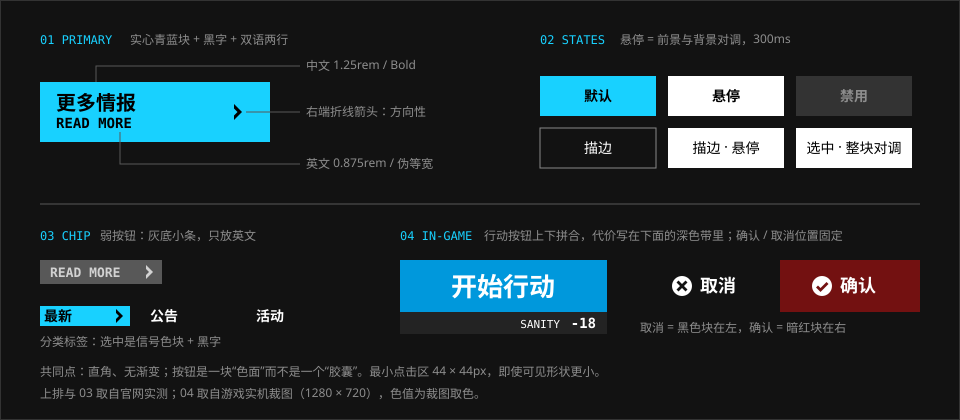

# 按钮

> 按钮是一块色面，不是一个胶囊。直角、平涂、双语两行，悬停时整块换色。

## 特征拆解

**1. 实心色块。** 主按钮是一整块青蓝，上面压黑字。没有圆角、没有渐变、没有投影。它看起来更像一张贴在画面上的标签，而不是一个“可以按下去”的立体物。

**2. 双语两行。** 中文在上（粗、大），英文在下（小、数据体）。英文不是装饰：它给按钮增加了一条水平的底线，让色块在视觉上更稳。

**3. 折线箭头。** 带跳转含义的按钮在右端放一个 `>` 形的折线箭头，贴着右边，和文字分在两头。官网的主按钮、弱按钮、分类标签用的是同一个箭头。

**4. 三个层级。**

| 层级 | 外观 | 用途 |
| --- | --- | --- |
| 主按钮 | 信号色实心块 + 黑字 | 一屏只有一个：更多情报、开始行动 |
| 次按钮 | 1px 白色半透明描边 + 白字 | 并列的次要操作 |
| 弱按钮 | 灰底小条 + 小号英文 | READ MORE、VIEW MORE |

**5. 悬停对调。** 主按钮悬停后底色由青蓝变白；描边按钮悬停后变成白底黑字。300ms，同时过渡 `color` 与 `background-color`。

**6. 游戏内：上下拼块。** 游戏里的行动按钮由两块拼成：上面一块主色写动作，下面一条深色带写代价（消耗的理智、合成玉）。确认 / 取消成对出现时，取消是黑色块、在左，确认是暗红块、在右，等宽对开；两者各有一个固定的图形（圆圈叉、圆圈对勾），文字可有可无。页面里建设性的确认（编队、升级、招募）换成蓝色块，图形不变。

**7. 代价写在按钮里。** “开始行动 -18”“寻访十次 6000”——点了会花掉什么，直接印在按钮上，不需要再读别处。

## 规范

| 项 | 主按钮 | 次按钮 | 弱按钮 | 可信度 |
| --- | --- | --- | --- | --- |
| 底色 | `--ark-color-signal-info` | 透明 | `--ark-color-neutral-gray-600` | 实测 |
| 文字色 | `#000` | `#fff` | `--ark-color-neutral-gray-300` | 实测 |
| 描边 | 无 | `1px solid rgba(255,255,255,.5)` | 无 | 实测 |
| 中文 | 思源黑体 Bold，`1.25rem` | 思源黑体，`1rem` | — | 实测 |
| 英文 | Bender Bold，`0.875rem` | — | Bender Bold，`0.875rem` | 实测 |
| 尺寸 | `14.375rem × 3.75rem` | 随内容 | `7.625rem × 1.5rem` | 实测 |
| 内边距 | `0 1.75rem 0 1rem` | — | `0 .625rem` | 实测 |
| 箭头 | 折线，宽 `0.5rem`，`margin-left: auto` | — | 折线，宽 `0.4375rem` | 实测 |
| 圆角 | `0` | `0` | `0`，可切一角 | 实测 / 社区 |
| 悬停 | 底色 → 白 | 底色 → 白，文字 → 黑 | 底色 → 白，文字 → 黑 | 实测 |
| 过渡 | `color .3s, background-color .3s` | 同左 | 同左 | 实测 |
| 最小点击区 | 44 × 44px | 44 × 44px | 44 × 44px（可见形状可以更小） | 社区 |

> **次按钮一列是估计，不是实测（2026-10-07 更正）。** 这一列原先标的是“实测”，但官网的样式表里没有这种“1px 白色半透明描边、悬停整块反白”的按钮。最接近的是首页的下载按钮：`10.5rem × 3rem`，描边 `1px solid #333`，圆角 `.25rem`，悬停时只把描边变成白色。次按钮现在的取值是本仓库按“直角、悬停整块换色”的原则定的。

### 游戏内的按钮（实机裁图）

取自 1280 × 720 的实机裁图，色值是对裁图取色，尺寸是裁图的像素。

| 按钮 | 做法 | 可信度 |
| --- | --- | --- |
| 行动按钮（开始行动） | `207 × 74px`：上块约 52px，主色 `#0098dc` 上压白色粗体；下面一条约 22px 的深色带（`#232323`），图标 + `-15` 贴右 | 社区（实机裁图） |
| 确认 | 弹窗、寻访是暗红 `#731111`；编队、升级、招募是蓝 `#0098dc` / `#0075a8`。图形是白色圆圈里一个对勾 | 社区（实机裁图） |
| 取消 | 黑色块（`#0c0c0c`–`#2b2b2b`），图形是白色圆圈里一个叉 | 社区（实机裁图） |
| 只有一个按钮的弹窗 | 黑色块 + 圆圈对勾 | 社区（实机裁图） |
| 开关（代理指挥） | 整块明暗对调：开是 `#232323` 底浅字，关是 `#a6a7a7` 底深字 | 社区（实机裁图） |
| 小号操作（最多 / 最少） | `#535353` 底白字 | 社区（实机裁图） |

### 状态

| 状态 | 表现 |
| --- | --- |
| 默认 | 见上表 |
| 悬停 | 前景与背景对调 |
| 按下 | 位移 1–2px 或亮度降低（估计） |
| 选中 | 整块明暗对调（实机的开关就是这样）；与悬停的区别是它一直保持 |
| 禁用 | 底色 `#333333`，文字 `#8d8d8d`，不响应悬停 |
| 焦点 | 外侧 2–3px 高对比轮廓，不被切角裁掉 |

```html
<a class="ark-btn" href="#">
  <span class="ark-btn__zh">更多情报</span>
  <span class="ark-btn__en">READ MORE</span>
</a>
```

```css
.ark-btn {
  display: inline-grid; align-content: center; gap: var(--ark-space-1);
  min-width: 14.375rem; min-height: 3.75rem;
  padding: 0 1.75rem 0 var(--ark-space-4);
  background: var(--ark-color-signal-info);
  color: #000;
  transition: color var(--ark-motion-duration-base),
              background-color var(--ark-motion-duration-base);
}
.ark-btn__zh { font: 700 var(--ark-font-size-body-lg)/1 var(--ark-font-family-cjk-sans); }
.ark-btn__en { font: 700 var(--ark-font-size-label)/1 var(--ark-font-family-data); }
@media (any-hover: hover) {
  .ark-btn:hover { background: var(--ark-color-neutral-white); }
}
```

## 示意图



## 官方参考

| 看什么 | 链接 | 说明 |
| --- | --- | --- |
| 主按钮（青蓝实心 + 双语） | [官网 · 情报](https://ak.hypergryph.com/#information) | 左下“更多情报 / READ MORE” |
| 弱按钮 | [官网 · 情报](https://ak.hypergryph.com/#information) | 列表下方的灰色 READ MORE |
| VIEW MORE + 短横线 | [官网 · 更多内容](https://ak.hypergryph.com/#more) | 四个入口的底部 |
| 游戏内的确认、取消、开始行动 | [MAA · resource/template](https://github.com/MaaAssistantArknights/MaaAssistantArknights/tree/dev-v2/resource/template) | 从实机裁出的控件图：`PopupConfirm`、`PopupCancel`、`Battle/StartButton/StartButton1` 等 |
| 社区实现 | [ak-ui · Buttons](https://ak-ui.yyj.moe/en/components/) | 可交互的按钮样例 |

## Do / Don't

| Do | Don't |
| --- | --- |
| 一屏一个主按钮 | 多个实心信号色按钮并排 |
| 直角、平涂 | 圆角胶囊、渐变、内发光 |
| 悬停整块换色 | 悬停只加一道发光描边 |
| 把代价写进按钮 | 让用户点了才知道要花什么 |
| 取消在左、确认在右，位置固定 | 确认与取消的左右位置随场景变化 |
| 确认与取消各用固定的图形 | 只靠颜色区分确认和取消 |

## 来源

- 官网计算样式实测（2026-10-06）
- [ak-ui · Official website UI study](https://ak-ui.yyj.moe/en/guide/official-site-study.html)
- 官网样式表逐条核对（2026-10-07）：主 / 弱按钮的尺寸、内边距与箭头
- 游戏内样式取自 [MAA](https://github.com/MaaAssistantArknights/MaaAssistantArknights) 的实机裁图（1280 × 720），色值为裁图取色（2026-10-07）
