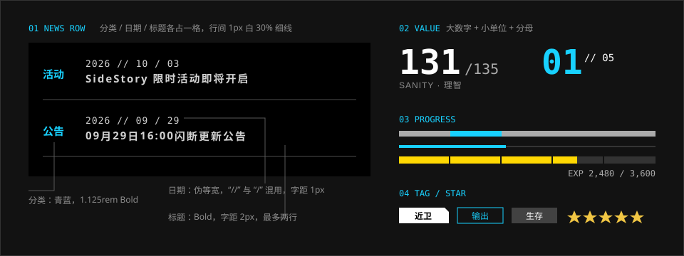

# 数据展示

> 数字是主角。大号数据体、前导零、分母、单位，一个都不省。

## 特征拆解

**1. 数值用数据体，且要大。** 理智、费用、等级、编号——凡是数字，都用伪等宽的数据体（Bender），字号明显大于旁边的标签。作战界面里“费用”是整屏最大的字。

**2. 当前值 / 上限。** 有上限的数值写成 `131/135`：当前值大而亮，分母小而灰。

**3. 标签在上或在左，数值右对齐。** 属性表是“左标签、右数值”；统计块是“上标签（英文小字）、下数值（大字）”。

**4. 列表行是三栏。** 官网新闻行由分类、日期、标题三格组成，各有自己的字体：分类是青蓝中文粗体，日期是数据体，标题是带字距的中文。行与行之间只有一条 1px 的半透明细线。

**5. 进度条是直角的细条。** 没有圆头，没有渐变，没有条纹动画。轨道是半透明的细线，进度是一段实色。需要分段时用细缝切开。等级这类“圆满”的概念用环形进度。

**6. 标签（Tag）是小矩形。** 实心白底黑字用在最要紧的属性上（干员详情里天赋的名称）；深色块白字是中性信息，干员的定位（近战位、输出、支援）就写在这种块里。放到纸白面上，实心标签变成黑底白字（主界面的“当前”、弹层里的物品名）。实机上没有见到描边的标签，也没有见到切角。

**7. 稀有度用颜色 + 数量双重编码。** 星级既写成若干颗星（或菱形），又通过卡片上的稀有度色体现——干员卡片上是名字带上方的一片光晕（六星是橙黄的半调网点）。任何一种编码单独拿掉，信息仍然完整。卡片上的星是偏柠檬的黄，一颗压住前一颗约两成，靠一圈深色的硬边分开；干员详情页里的星是白色的。

**8. 相对值用一条半透明的条表示。** 干员属性的数值背后垫着一条与图标等高的半透明条，长度表示该数值在同职业中的相对高低——不需要读数字就能比较。

**9. 提醒标记与计数。** 未读、可领取用一个橙色的菱形，带一圈白边，骑在元素的角上——收取信用的按钮、主界面的“档案”面板、带奖励的邮件图标都是这样。数量写在一块直角的色块里：白色的图标加白色的数字，告警是暗红，通知是蓝。实机上没有圆形的红点。

## 规范

### 数值

| 项 | 值 | 可信度 |
| --- | --- | --- |
| 字体 | `--ark-font-family-data`，Bold | 实测 |
| 主数值字号 | 标签的 2.5–4 倍 | 估计 |
| 分母 | 主数值的 40–50%，`--ark-color-neutral-gray-400` | 估计 |
| 标签 | 英文窄体大写，`0.75rem`，字距 `0.1em`，灰色 | 估计 |
| 千分位 | 使用逗号：`128,400` | 估计 |
| 前导零 | 编号、序号补零到两位以上：`01`、`0147` | 实测 |

### 新闻 / 列表行（官网实测）

| 项 | 值 |
| --- | --- |
| 分类 | 思源黑体 Bold，`1.125rem`，`#18d1ff` |
| 日期 | Bender Regular，`1rem`，字距 `1px`，`#d2d2d2`（与标题同色），格式 `YYYY // MM / DD` |
| 标题 | `font-weight: 700`，`1.125rem`，字距 `2px`，`#d2d2d2`，最多两行 |
| 日期与标题的间距 | `.125rem` |
| 行分隔 | `1px solid hsla(0,0%,100%,.3)` |
| 行的尺寸 | `22.5rem × 6rem`，右侧的日期与标题一栏宽 `17.5rem` |
| 竖屏 | 日期移到标题右侧，行高与字号重新设定 |

### 进度

| 类型 | 做法 | 可信度 |
| --- | --- | --- |
| 轮播条 | 轨道与进度同为 `0.5rem` 高；轨道 `#ababab`，进度段 `#18d1ff`，只占当前这一页的位置（不累计），`transition .3s`；轨道左侧接一段 `12rem × 1px` 的渐隐线 | 实测（官网轮播） |
| 线性（细） | 轨道 `1px` 白 30–50%，进度 `4px` 信号色 | 估计 |
| 线性（粗） | 高 `6–10px`，轨道深灰，进度黄或信号色，可用 2px 缝分段 | 估计 |
| 环形 | 线宽约为直径的 6%（4–6px），起点在 12 点方向；数字居中，`LV` 在数字上方；等级环是黄色。压在立绘上时环内垫一块半透明黑的圆底。主界面的等级是细环，`LV` 在数字下面 | 社区（实机截图） |
| 相对值条 | 高 `2px`，白色，轨道白 25% | 估计 |
| 信赖值 | 标签下面一条约 4px 的细色条 | 社区（实机截图） |

> 实机干员详情里，属性的相对高低不是数字下面的细线，而是**数字背后的一条半透明浅色条**，条的长度就是相对值。属性表（`AttributeList`）已经照这个样子做了，见 [游戏 · 干员](../modules/game/operator.md)。上表的“相对值条”是另一种 2px 的细条，没有实机出处，留作通用的写法。

> **2026-10-07 更正：** “线性（细）”原先标的是“实测（官网轮播）”，但官网轮播下面那一条并不是 1px 轨道加 4px 进度，而是上面“轮播条”一行的写法。细条的取值因此改标为估计，仍然用于加载。

### 标签与星级

| 项 | 做法 | 可信度 |
| --- | --- | --- |
| 主标签 | 白底黑字，Bold，高 20–24px；纸白面上是黑底白字（裁图取色 `#383838`） | 社区（实机截图） |
| 中性标签 | 深色块白字（`--ark-color-neutral-graphite`），定位用它 | 社区（实机截图） |
| 描边标签 | `1px` 描边，文字同描边色。实机上没有见到 | 估计 |
| 标签切角 | 右上角 `--ark-cut-sm`。实机上没有见到 | 估计 |
| 星级 | `--ark-color-tier-star`（`#f1d94a`），五角星；节距约为星高的 0.8，也就是后一颗压住前一颗两成，各带一圈深色硬边 | 社区（实机截图） |
| 星级（菱形） | 间距为图形宽的 20–30% | 估计 |
| 稀有度底边 | 卡片底部 3–4px 色条，取 `--ark-color-tier-*` | 估计 |
| 提醒标记 | 橙色菱形（`--ark-color-signal-accent`，`#ff5e19`），1px 白边，中心压在元素的角上 | 社区（实机裁图） |
| 计数 | 直角色块，白色图标 + 白色数字。告警 `--ark-color-signal-alert`（`#a32339`）；通知是蓝（取色 `#229ed5`） | 社区（实机截图） |

> **2026-10-07 更正：** 这张表原先写的是“次标签用描边”“星级用 `tier-5` 的金色、间距 20–30%”，第 9 条写的是“小红点 + 右上角的小数字”。对照实机后：定位用的是深色块而不是描边；星是更偏柠檬的黄，并且互相重叠；提醒是橙色菱形，计数是带图标的色块。
>
> 计数的蓝色在实机里压的是白字，对比度只有 3:1。组件里通知一类用的是信号色配它自己的前景色。

```html
<dl class="ark-stat">
  <dt>SANITY</dt>
  <dd><b>131</b><span>/135</span></dd>
</dl>
```

```css
.ark-stat dt { font: 500 var(--ark-font-size-caption)/1 var(--ark-font-family-latin-condensed);
               letter-spacing: var(--ark-font-tracking-wide); color: var(--ark-color-neutral-gray-500); }
.ark-stat dd { font-family: var(--ark-font-family-data); line-height: 1; }
.ark-stat b    { font-size: 3rem; color: var(--ark-color-neutral-white); }
.ark-stat span { font-size: 1.25rem; color: var(--ark-color-neutral-gray-400); }
```

## 示意图



## 官方参考

| 看什么 | 链接 | 说明 |
| --- | --- | --- |
| 新闻行的三栏结构 | [官网 · 情报](https://ak.hypergryph.com/#information) | 左侧新闻列表 |
| 轮播进度条 | [官网 · 情报](https://ak.hypergryph.com/#information) | 主视觉下方的青蓝段 + 灰轨 |
| 干员卡片上的星级、职业、等级 | [干员一览 · PRTS](https://prts.wiki/w/%E5%B9%B2%E5%91%98%E4%B8%80%E8%A7%88) | 稀有度的颜色编码 |
| 社区实现 | [ak-ui · Components](https://ak-ui.yyj.moe/en/components/) | Levels、Sanity、Progress |

## Do / Don't

| Do | Don't |
| --- | --- |
| 数字比标签大得多 | 数字和标签同字号 |
| 写出分母和单位 | 只给一个孤立的数字 |
| 进度条直角、平涂 | 圆头、渐变、流光动画 |
| 颜色之外再给一种编码（数量、图形、文字） | 只靠颜色区分稀有度 |
| 行间用 1px 细线 | 每行一个带底色的卡片 |

## 来源

- 官网计算样式实测（2026-10-06）；样式表逐条核对（2026-10-07）：新闻行的字重、颜色与间距，轮播条的轨道与进度段
- [ak-ui · Official website UI study](https://ak-ui.yyj.moe/en/guide/official-site-study.html)
- [从 TA 的视角看 UI #1](https://zhuanlan.zhihu.com/p/570566718)（干员信息的排版约定）
- 标签、星级、提醒标记、计数、等级环对照了实机：PRTS 的主界面截图（1280 × 720，取色）、机核文章里的干员列表与干员详情截图、MAA 的模板图（2026-10-07）
