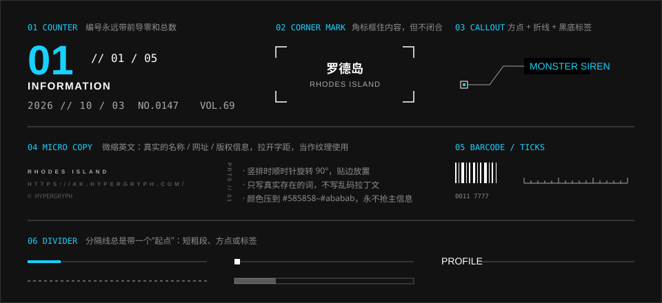

# 装饰元素

> 装饰都“有来历”：编号是真的编号，小字是真的网址。它们像设备铭牌上的信息，不像花边。

## 特征拆解

**1. 编号带前导零和总数。** 官网右栏的 `01 // 01 / 05` 是最典型的写法：一个大号数字，后面跟“当前 / 总数”。大数字装在一个比它矮的框里，下缘被裁掉约四分之一，和背景巨字一样像被一条水平线切过。任何可以数的东西（分屏、轮播、列表项、章节）都可以这样标。

**2. 日期的斜杠有节奏。** 官网日期写作 `2026 // 10 / 03`：年和月之间是双斜杠，月和日之间是单斜杠，斜杠两侧留空格。它把一个普通的日期变成了一个有辨识度的图形。

**3. 微缩英文当纹理。** 画面边角有一些 6px 左右、字距拉得很开的英文：品牌名、网址、版权标记。它们小到不需要被读，但写的都是真实内容。竖排时贴边放。

**4. 角标不闭合。** 用四个 L 形角标框住一块内容，而不是画一个完整的矩形。视线会自动补全边框，画面更透气。

**5. 分隔线有“起点”。** 一条分隔线很少是从头到尾均匀的。它往往以一小段粗色条、一个小方块或一个英文标签开头，后面才是细线；或者一端渐隐。

**6. 标注是小方框加灰字，选中才出标签。** 官网泰拉万象屏在场景的每个物件旁放一个标注：一个带斜杠的小方框，后面一行窄体灰字，悬停变白。点开某个物件后，它的标注换成一块图标加黑底信号色字的标签，物件本身套上一圈白框，背后垫一块信号色的方块。标注直接摆在物件旁边，没有引线。

**7. 条码、刻度、坐标。** 条形码、标尺刻度、经纬度式的数字偶尔出现在宣传物料和品牌视觉里，强化“工业制品 / 档案 / 货物”的语感。其中一些还被玩家当作解谜线索。

**8. 背景巨字。** 每屏背后的巨型英文（见 [字体与排版](../foundations/typography.md)）本身也是装饰，同时是这一屏的标题。

**9. 装饰重复了信息。** 好的装饰是对内容的第二次表述：栏目名用巨字再写一次，编号用大数字再写一次。去掉它们信息不缺，留着它们层次更多。

## 规范

| 元素 | 写法 | 可信度 |
| --- | --- | --- |
| 计数 | `NN // NN / NN`，整块宽 `10rem`。大数字 Novecento Sans Wide DemiBold `5.4rem`、信号色，行高 `0.55` 加 `overflow: hidden`，下缘被裁掉约四分之一；“// 当前 / 总数” Bender Regular `1.125rem`、白色，靠右，压在大数字的高度以内；下面一行微缩字（品牌名）；栏目名 Novecento Sans Wide DemiBold `1.125rem`、字距 `0.1em`，靠右 | 实测 |
| 日期 | `YYYY // MM / DD`，Bender Regular `1rem`，字距 `1px` | 实测 |
| 序号 | `NO.0147`、`VOL.69`，数据体 | 估计（官网没有） |
| 微缩英文 | Novecento Sans Wide Medium，`0.375rem`，字距 `0.5em`；颜色跟随所在的文字，官网唯一的一处是白的 | 实测 |
| 版权标记 | 官网的 `© HYPERGRYPH` 是一张 SVG 图形，不是文字；加载屏里它是 `#a4a4a4` | 实测 |
| 角标 | L 形，边长 12–16px，线宽 1–2px，白色 | 估计（官网没有） |
| 标注（待机） | 小方框 `1rem` 见方、`2px` 描边、`2px` 圆角，里面一道 45° 的斜杠（一根 `2px × 75%` 的竖条 `skewX(45deg)`）；右距 `0.75rem` 接一行 Oswald Medium `0.875rem` 的字；`#9e9e9e`，悬停变白 | 实测 |
| 标注（选中） | 黑底标签，Oswald Medium `1.25rem`，信号色文字，内边距 `0 0.5rem 0 0.25rem`；上面一块 `4.875rem` 宽的图标，标签至少与它同宽 | 实测 |
| 分隔线起点 | `3.5rem × 3px` 的白色短粗段，空 `0.5rem` 再接 30% 的细线（公告页标题下）；或 6px 方块（加载条的两端） | 实测 |
| 标题下的粗条 | `14.375rem × 0.5rem`，信号色，上距 `1.5rem`（泰拉万象屏的标题组） | 实测 |
| 虚线 | `--ark-pattern-dash` | 实测 |
| 渐隐线 | `--ark-pattern-fade-rule` | 实测 |
| 背景巨字 | Oswald Medium `7rem`，字距 `-0.05em`，`#242424`；装在一个高 `0.95em` 的框里贴底放，上缘被裁掉大写高的 16%。公告页的那个是 `12.5rem`、`#5f5f5f` | 实测 |

> **2026-10-08 更正。** 重读官网样式表和 DOM 之后改了五处：
>
> - 计数的大数字是被裁切的，后三行全部靠右，中间还有一行微缩字。原先的示例把行高写成了 `0.8`。
> - 标注没有折线。原先写的“空心方点内嵌实心点、先水平后斜向的折线”是估计，官网上是带斜杠的小方框加灰字，选中才换成黑底标签。
> - 分隔线的起点是白的，`3.5rem × 3px`，和细线之间留一道缝。原先写的“`4px × 3rem` 信号色段”是估计。
> - 微缩英文在样式表里只有一处，是白的。原先写的 `#585858`–`#ababab` 没有出处。
> - 背景巨字的上缘被裁掉一截。
>
> 序号、角标，以及下面提到的条码、刻度，在官网上没有出现，仍是估计。

```html
<p class="ark-counter">
  <b>01</b>
  <span>// 01 / 05</span>
  <span lang="en">INFORMATION</span>
</p>
<time class="ark-date" datetime="2026-10-03">2026 // 10 / 03</time>
```

```css
/* 官网的写法。行高比字矮、再裁掉溢出：大数字的下缘就少了一截 */
.ark-counter { width: 10rem; }
.ark-counter b { display: block; overflow: hidden;
                 font: 600 5.4rem/0.55 var(--ark-font-family-latin-wide); color: var(--ark-color-signal-info); }
.ark-counter span { display: block; text-align: right;
                    font: 400 var(--ark-font-size-body)/normal var(--ark-font-family-data); }
.ark-counter b + span { margin-top: -1.75em; } /* 提上去，压在大数字的高度以内 */
.ark-counter [lang="en"] { font: 600 var(--ark-font-size-body)/normal var(--ark-font-family-latin-wide);
                           letter-spacing: var(--ark-font-tracking-wide); }
.ark-date { font: 400 1rem/1 var(--ark-font-family-data); letter-spacing: 1px; }
.ark-micro { font: 500 var(--ark-font-size-micro)/1 var(--ark-font-family-latin-wide);
             letter-spacing: var(--ark-font-tracking-micro); }
```

用行高裁字，裁掉多少取决于字体的度量：Novecento 的数字比大写字母矮，裁掉的正好是下缘；换一个回退字体，上缘也会被裁。组件库里的 `Counter` 和 `GhostTitle` 换了一种不依赖字体的做法，见 [组件库的说明](../../packages/react/README.md#与文档的出入)。

### 密度

| 场景 | 建议 |
| --- | --- |
| 内容型页面（文章、文档） | 只保留编号与分隔线起点 |
| 展示型页面（首页、专题） | 加上背景巨字、角标、微缩英文 |
| 沉浸型页面（终端、仪表盘） | 可再加条码、刻度、标注点 |

这三档对应 ak-ui 提出的 `accent / system / terminal` 三级强度。

### 无障碍

- 纯装饰的微缩英文加 `aria-hidden="true"`，避免屏幕阅读器逐字母朗读。
- 日期用 `<time datetime>` 提供标准格式。
- 背景巨字若与标题重复，标记为装饰；若是唯一的标题，则保证对比度并使用真实的标题标签（官网的 `#242424` 对黑底对比度很低，只能作为装饰）。

## 示意图



## 官方参考

| 看什么 | 链接 | 说明 |
| --- | --- | --- |
| 右栏计数、日期写法 | [官网 · 情报](https://ak.hypergryph.com/#information) | 右侧 `01 // 01 / 05`，新闻日期 |
| 微缩英文、版权标记 | [官网 · 首页](https://ak.hypergryph.com/#index) | 左下角与右栏的小字 |
| 标注的两种状态 | [官网 · 泰拉万象](https://ak.hypergryph.com/#media) | 物件旁的小方框加灰字；点开物件后换成黑底标签 |
| 分隔线的起点 | [官网 · 情报](https://ak.hypergryph.com/#information) 里的任意一条公告 | 标题下面：白色短粗段接细线 |
| 背景巨字 | [官网 · 设定](https://ak.hypergryph.com/#world) | WORLD |
| 条码、数字串在品牌视觉中的使用 | [我在明日方舟里面学平面设计](https://zhuanlan.zhihu.com/p/145684354) | 0011 系列的条形码与数字 |

## Do / Don't

| Do | Don't |
| --- | --- |
| 装饰文字写真实内容 | 乱码、Lorem ipsum、无意义的十六进制串 |
| 编号带总数 | 只写一个孤零零的 “01” |
| 装饰压到最低对比度 | 装饰比正文还亮 |
| 按页面类型控制密度 | 每个元素都编号、都加角标、都大写 |
| 分隔线给一个起点 | 满屏均匀的整条横线 |

## 来源

- 官网计算样式实测（2026-10-06）；右栏计数的字体与字号在 2026-10-07 重新读取并更正（原先写的是“大数字 Bender Bold”）
- 2026-10-08 重读官网样式表与 DOM：计数的裁切与排法、标注的两种状态、分隔线起点、微缩英文、背景巨字的裁切。字体的大写高、数字高用 canvas 的 `measureText` 读取
- [ak-ui · Design language](https://ak-ui.yyj.moe/en/guide/design-language.html)（强度分级、常见失败模式）
- [我在明日方舟里面学平面设计](https://zhuanlan.zhihu.com/p/145684354)
