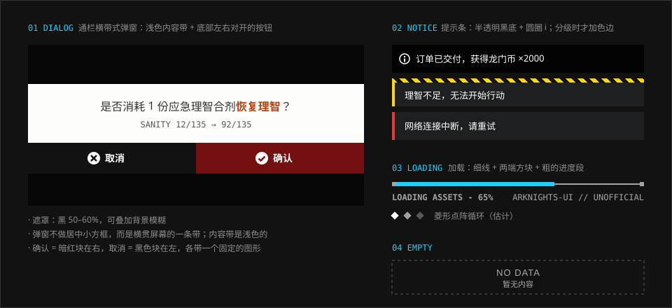

# 反馈

> 弹窗是横贯屏幕的一条带，不是悬在中间的一个盒子。提示是一条半透明的黑底，需要分级时才在左侧加一条色边。

## 特征拆解

**1. 通栏横带式弹窗。** 游戏内的确认弹窗不是居中的圆角卡片，而是一条横贯屏幕的浅色带：深色字写问题，后果（“返还 5 理智”“获得部分奖励”）用橙色标出，下方是左右对开的两个大按钮。上下两侧露出被压暗的原页面。

**2. 按钮对开，位置固定。** 取消在左（黑色块、圆圈叉），确认在右（暗红块、圆圈对勾），各占一半宽度。按钮上可以只有图形，也可以写出具体动作（“放弃行动”“继续结算”）。只有一个按钮的告知弹窗是一整条黑色块加圆圈对勾。全游戏一致，形成肌肉记忆。

**3. 次级系统在原页面上呼出。** 签到、邮件、设置等不跳转新页面，而是在当前页面上以浮层形式出现，背景模糊。用户始终知道自己在哪。

**4. 抽屉直接关闭。** 抽屉式页面应当“点返回即关闭”。早期基建的抽屉在关闭时带二次确认，被评论文章指为不符合常见产品逻辑——反馈层级不应比操作本身更重。

**5. 提示条是一条半透明的黑底。** 前面一个白色的圆圈 i，后面是白字，不加任何颜色——干员页里“精英化晋升干员以继续提高干员等级”、代理作战底部的“代理指挥作战正常运行中”都是这样。实机上只见到信息这一级；需要分级时，警示在左侧加黄边（可加一条警戒条纹），错误加红边，底色仍然保持深色，不整条变色。

**6. 加载展示内容。** 长加载时铺满插画或标识，实机就是这样。短加载用一条细进度条加百分比和英文状态文字，这是本仓库的写法，实机上没有找到出处。

**7. 奖励有光。** 获得物品时，物品图标背后有一圈静态的放射光。这是少数允许“发光”的时刻，因为它标记的是一次正向结果。

**8. 可点击的东西要看得出来。** 评论文章指出干员详情页左侧的属性、信赖、攻击范围其实可以点击，但外观与不可点击的文字没有区别。可交互元素至少需要一个视觉线索（描边、箭头、底色）。

## 规范

### 弹窗

| 项 | 值 | 可信度 |
| --- | --- | --- |
| 遮罩 | `--ark-color-overlay-scrim` 至 `--ark-color-overlay-scrim-strong`，可加 `backdrop-filter: blur(0.5rem)` | 估计 |
| 内容带 | 通栏，浅色（裁图取色 `#fcfcfc`–`#e4e4e4`，取 `--ark-color-neutral-paper`），上面有很淡的斜线底纹 | 社区（实机裁图） |
| 文字 | 居中，深色（`--ark-color-neutral-paper-ink`），中文 `1rem–1.125rem`；补充数值用数据体小字 | 社区（实机裁图） |
| 后果的高亮 | 橙色粗体。`--ark-color-signal-accent` 在纸白上只有约 3:1，压暗到 70% 再用 | 社区（实机裁图）；压暗是本仓库的决定 |
| 取消 | 左半，黑色块（裁图取色 `#0c0c0c`，取 `--ark-color-neutral-ink-950`），白色圆圈叉 | 社区（实机裁图） |
| 确认 | 右半，暗红块（`--ark-color-signal-confirm`，`#731111`），白色圆圈对勾 | 社区（实机裁图） |
| 只有一个按钮 | 一整条黑色块，圆圈对勾 | 社区（实机裁图） |
| 按钮高度 | 实机约为屏高的 10%（720p 下 72px）；网页上不低于 44px | 社区（实机裁图） |
| 入场 | 内容带纵向展开或淡入，`--ark-motion-duration-base` | 估计 |

> **这一节在 2026-10-07 按实机更正。** 原先写的是“深色内容带、左石墨右纸白的按钮”，那是凭印象归纳的。对照实机裁图后发现内容带是浅色的，按钮是黑与暗红，并且各有固定的图形。

### 提示条

| 级别 | 左边色 | 图形 | 附加 | 可信度 |
| --- | --- | --- | --- | --- |
| 信息 | 无 | 白色的圆圈 i | — | 社区（实机裁图） |
| 警示 | `--ark-color-signal-action` | 黄色三角 | 顶部 `--ark-pattern-hazard` 窄边 | 估计 |
| 错误 | `--ark-color-signal-danger` | 红色菱形 | — | 估计 |
| 底色 | 黑约 85%，半透明 | — | — | 社区（实机裁图） |

> **2026-10-07 更正：** 原先三个级别都有色边，底色是不透明的 `ink-900`。实机的提示条没有色边，底是半透明的黑。信息级照实机改了；警示和错误在实机上没有找到对应的提示条（这类情况游戏里用的是弹窗），色边保留为估计。

### 加载

| 项 | 值 | 可信度 |
| --- | --- | --- |
| 进度条 | 轨道 1–2px 白 30%，进度 4px 信号色 | 估计（实机的加载是整屏的标识或插画，没有这种细条） |
| 状态文字 | 数据体大写，`0.75rem`，如 `LOADING ASSETS...` | 估计 |
| 百分比 | 数据体，右对齐 | 估计 |
| 旋转指示 | `1s linear infinite` | 实测（官网轮播预加载） |
| 光标闪烁 | `1s step-end` | 实测 |

### 空状态

虚线框 + 窄体英文 `NO DATA` + 中文小字说明。不放插画。它是画面里最安静的一块，但文字必须读得清。

| 项 | 取值 | 可信度 |
| --- | --- | --- |
| 文字（`NO DATA` 与说明） | 所在表面的次要文字色：黑底 `--ark-color-neutral-gray-400`，石墨面板 `--ark-color-neutral-gray-300`，纸白面板 `--ark-color-neutral-gray-600` | 估计 |
| 虚线框 | `1px dashed`，颜色取文字色的 50% 不透明度；黑底上约等于 `--ark-color-neutral-gray-600` | 估计 |

> **已知问题：原取值对比度不足（2026-10-06 记录）。** 这一节原先写的是三样“全部使用 `--ark-color-neutral-gray-600`”。给 React 组件做无障碍检查（axe-core）时发现，`#585858` 的文字在纯黑底上只有 2.95:1，达不到 WCAG 2 AA 对正文要求的 4.5:1；放进石墨面板只剩 1.53:1。没有说明文字时 `NO DATA` 是唯一的信息，问题最明显。
>
> 现在的取值是本仓库为满足对比度做的设计决定，不是从游戏里量出来的。虚线框是装饰，不受 4.5:1 约束，所以保持原来的暗度。

各档灰用作文字时的对比度（按 WCAG 2 公式计算，加粗的是该表面上的取值）：

| 文字色 | 纯黑画布 | 石墨面板 | 纸白面板 |
| --- | --- | --- | --- |
| `gray-600` `#585858`（原取值） | 2.95 | 1.53 | **5.57** |
| `gray-500` `#8d8d8d` | 6.33 | 3.29 | 2.60 |
| `gray-400` `#ababab` | **9.14** | 4.75 | 1.80 |
| `gray-300` `#d2d2d2` | 13.89 | **7.22** | 1.18 |

石墨、纸白面板是半透明的，表中按压在纯黑底上计算（约 `#3d3d3d`、`#e4e4e2`）。石墨面板下面的场景越亮，对比度越低：压在 `#465560` 上时 `gray-400` 只有 4.29，所以石墨面板取 `gray-300`。

“纯黑画布”一列的取值对 `#333333` 及更深的底色都成立（`gray-400` 在 `#333333` 上是 5.50）。直接压在更亮的场景图上就不够了，在 `#465560` 上只有 3.35；这时先加遮罩或放进面板，做法见 [图片](../foundations/imagery.md)。

```html
<dialog class="ark-dialog">
  <p>是否消耗 1 份应急理智合剂恢复理智？</p>
  <form method="dialog">
    <button value="cancel">取消</button>
    <button value="ok">确认</button>
  </form>
</dialog>
```

```css
.ark-dialog { width: 100vw; max-width: none; margin: auto 0; padding: 0; border: 0;
              background: var(--ark-color-neutral-paper); color: var(--ark-color-neutral-paper-ink);
              text-align: center; }
.ark-dialog::backdrop { background: var(--ark-color-overlay-scrim);
                        backdrop-filter: blur(var(--ark-blur-backdrop)); }
.ark-dialog form { display: grid; grid-template-columns: 1fr 1fr; }
.ark-dialog button { min-height: 2.75rem; border: 0; color: #fff;
                     font: 700 1rem/1 var(--ark-font-family-cjk-sans); }
.ark-dialog button[value="cancel"] { background: var(--ark-color-neutral-ink-950); }
.ark-dialog button[value="ok"]     { background: var(--ark-color-signal-confirm); }
```

## 示意图



## 官方参考

| 看什么 | 链接 | 说明 |
| --- | --- | --- |
| 浮层与层级简化 | [UI/UX 分析（GameRes）](https://www.gameres.com/849200.html) | “过场衔接技巧与系统结构”一节 |
| 抽屉关闭逻辑、可点击区域不明显 | [《明日方舟》UI/UX 设计复盘](https://www.gcores.com/articles/123154) | “不足 2”“不足 3” |
| 弹层的社区实现 | [ak-ui · Components](https://ak-ui.yyj.moe/en/components/) | Dialog、Notice、Loading |
| 提示条的实机裁图 | [MAA · resource/template](https://github.com/MaaAssistantArknights/MaaAssistantArknights/tree/dev-v2/resource/template) | `OperBox/OperFiles/OperFilesCannotEnterLevelUpPage` |
| 确认弹窗的实机裁图 | [MAA · resource/template](https://github.com/MaaAssistantArknights/MaaAssistantArknights/tree/dev-v2/resource/template) | `Battle/BattleFlag/PrtsErrorConfirm`（整条内容带与两个按钮）、`PopupCancel`、`PopupConfirm`、`OfflineConfirm` |

## Do / Don't

| Do | Don't |
| --- | --- |
| 弹窗通栏，露出上下的原页面 | 居中圆角小卡片 |
| 确认右、取消左，全站一致 | 危险操作时把按钮顺序反过来 |
| 用色边区分提示级别 | 整条提示变成大红大黄 |
| 可点击元素给出视觉线索 | 让可点击文字与普通文字长得一样 |
| 反馈的重量与操作相称 | 关闭一个抽屉也要二次确认 |
| 空状态的文字用所在表面的次要文字色 | 为了“安静”把文字压到 4.5:1 以下 |

## 来源

- [《明日方舟》UI/UX 分析——藏在好看背后的先进性](https://www.gameres.com/849200.html)
- [《明日方舟》UI/UX 设计复盘](https://www.gcores.com/articles/123154)
- 官网样式表实测（2026-10-06）
- 游戏内弹窗取自 [MAA](https://github.com/MaaAssistantArknights/MaaAssistantArknights) 的实机裁图（1280 × 720），色值为裁图取色（2026-10-07）
- 空状态的对比度：axe-core 检查与 WCAG 2 对比度公式计算（2026-10-06）
