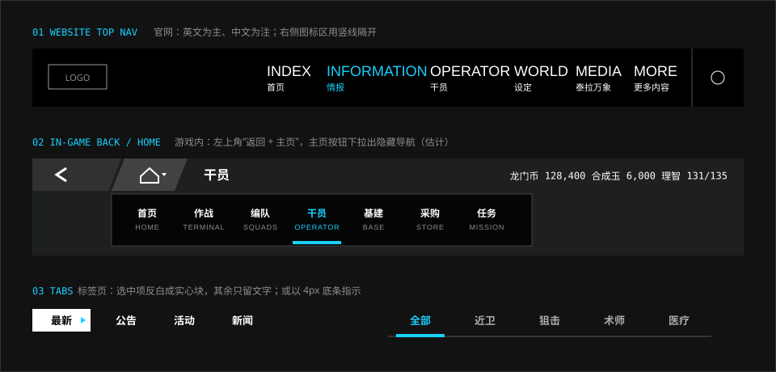

# 导航

> 导航永远在同一个地方。官网是顶部一排双语标签，游戏是左上角“返回 + 主页”。

## 特征拆解

### 官网

**1. 双语标签。** 每个导航项是两行：上面英文窄体（1.375rem），下面中文小字（0.875rem）。英文是视觉主体，中文是说明。

**2. 只用颜色表示当前项。** 当前项整体变成青蓝，没有下划线、底色或加粗。

**3. 右栏计数。** 屏幕右侧一条竖线隔出窄栏，里面是当前分屏的编号与名称：`01 // 01 / 05 INFORMATION`。它相当于纵向的面包屑。

**4. 固定不动。** 六个分屏滚动切换时，导航与右栏原地不动，只有颜色和数字变化。

**5. 竖屏收进菜单。** 竖屏下导航折叠为汉堡按钮，展开后是全屏菜单，项目放大为大号列表（英文约 `2.25rem`、中文约 `1.75rem`），逐项淡入。

### 游戏

**6. 返回 + 主页。** 所有二级页面的左上角是两个相邻的斜切色块：返回箭头和主页图标。位置、大小从不改变。

**7. 隐藏式快捷导航。** 点击主页图标旁的下拉，会展开一条横向的快捷导航，可以直接跳到任何一个系统，而不必先回到主界面。平时它是隐藏的，不占用空间。这个设计常被拿来与《公主连结》的导航方式类比。

**8. 导航被包装成场所。** 主界面的入口不是一张功能列表，而是对应罗德岛本舰的不同区域。菜单因此有了空间感。

**9. 全局物品跳转。** 任何地方出现的物品图标都可以点开，查看来源并直接跳到对应关卡。物品本身就是导航入口。

### 标签页

**10. 反白块或底条。** 标签页有两种写法：选中项变成实心反白块（其余只留文字），或在选中项下方加一条 4px 信号色条（其余文字变灰）。

## 规范

### 官网顶栏（实测）

| 项 | 值 |
| --- | --- |
| 英文 | Oswald Medium，`1.375rem`，行高 `normal` |
| 中文 | 思源黑体 Medium，`0.875rem` |
| 默认色 | `#ffffff` |
| 当前项 | `#18d1ff`（英文与中文同时变色） |
| 过渡 | `color .3s` |
| 竖屏菜单项 | 英文 `2.25rem` 左右、中文 `1.75rem` 左右，逐项延迟入场 |
| 右栏计数数字 | Bender Bold，青蓝 |
| 右栏英文标签 | Novecento Sans Wide DemiBold，`12px`（1280 宽时），字距 `0.1em` |

### 游戏内导航（估计）

| 项 | 做法 |
| --- | --- |
| 返回按钮 | 深灰平行四边形，白色粗箭头，贴左上角 |
| 主页按钮 | 紧邻返回，稍浅的灰，房屋图标 + 下拉小三角 |
| 快捷导航条 | 黑色半透明横条，项目为“中文 + 英文小字”，当前项信号色 + 底条 |
| 资源条 | 贴右上角，数据体数字，半透明黑底 |

### 标签页

| 写法 | 选中 | 未选中 | 可信度 |
| --- | --- | --- | --- |
| 反白块 | 白底黑字，右侧可带小三角 | 白字无底 | 实测（官网新闻分类） |
| 底条 | 信号色文字 + `4px` 底条 | `#ababab` 文字 | 估计 |

```html
<nav class="ark-nav" aria-label="主导航">
  <a href="#index"><span lang="en">INDEX</span><span>首页</span></a>
  <a href="#information" aria-current="location"><span lang="en">INFORMATION</span><span>情报</span></a>
</nav>
```

```css
.ark-nav { display: flex; gap: var(--ark-space-6); }
.ark-nav a { display: grid; color: var(--ark-color-neutral-white);
             transition: color var(--ark-motion-duration-base); }
.ark-nav [lang="en"] { font: 500 var(--ark-font-size-nav)/1.3 var(--ark-font-family-latin-condensed); }
.ark-nav span:last-child { font: 500 var(--ark-font-size-label)/1.4 var(--ark-font-family-cjk-sans); }
.ark-nav [aria-current] { color: var(--ark-color-signal-info); }
```

> 当前项只靠颜色区分时，务必同时提供 `aria-current`，并考虑为色觉障碍用户补一个非颜色的标记（如 4px 底条）。

## 示意图



## 官方参考

| 看什么 | 链接 | 说明 |
| --- | --- | --- |
| 双语顶栏与右栏计数 | [官网](https://ak.hypergryph.com/) | 任意分屏 |
| 新闻分类的反白标签 | [官网 · 情报](https://ak.hypergryph.com/#information) | “最新 / 公告 / 活动 / 新闻” |
| 隐藏式导航的分析 | [《明日方舟》UI/UX 设计复盘](https://www.gcores.com/articles/123154) | “优化 1：隐藏式导航栏” |
| 场所化导航的分析 | [UI/UX 分析（GameRes）](https://www.gameres.com/849200.html) | “系统导航与场景化包装” |
| 社区实现 | [ak-ui · ak-nav](https://ak-ui.yyj.moe/en/components/) | 原生链接 + 主 / 辅标签 |

## Do / Don't

| Do | Don't |
| --- | --- |
| 导航位置全站固定 | 不同页面导航位置不同 |
| 英文与中文成对，大小有别 | 中英文同字号并排 |
| 提供从任意页面直达任意系统的捷径 | 强迫用户层层返回 |
| 告诉用户“现在在第几屏 / 共几屏” | 长页面没有任何位置提示 |
| 窄屏重新编排成大号列表 | 把横排导航缩小到看不清 |

## 来源

- 官网计算样式实测（2026-10-06）
- [ak-ui · Official website UI study](https://ak-ui.yyj.moe/en/guide/official-site-study.html)（竖屏行为）
- [《明日方舟》UI/UX 设计复盘](https://www.gcores.com/articles/123154)
- [《明日方舟》UI/UX 分析——藏在好看背后的先进性](https://www.gameres.com/849200.html)
