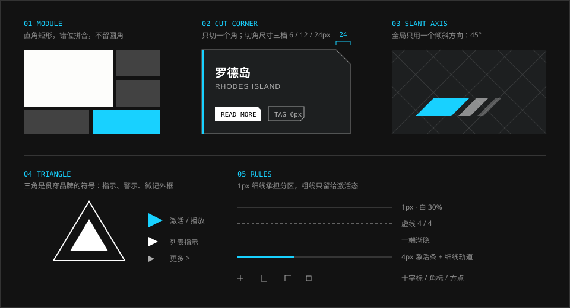

# 几何语言

> 直角矩形是基本单位，切一个角、斜一条边、放一个三角，就够了。

## 特征拆解

**1. 矩形是默认形状。** 面板、按钮、标签、头像框、进度条都是直角矩形。整套界面几乎找不到圆角——圆形只出现在少数图标外框和环形进度上。相比同类游戏常见的圆角与内发光，这种棱角分明的处理显得冷静、“不近人情”，这正是它的气质来源。

**2. 错位拼合。** 矩形不排成整齐的等大网格，而是大小不一地拼在一起：一块大的配两三块小的，或一行三等分下面接一行两等分。块与块之间留很窄的缝。

**3. 切角是点睛，不是默认。** 切角（把矩形的一个角削掉）只用在需要强调“这是一个可操作的东西”或“这是一张卡”的地方，并且**只切一个角**。四个角全切会变成另一种风格（更接近《终末地》或一般的科幻 HUD）。

**4. 只有一个倾斜方向。** 斜线统一是 45°：背景的对角线网格、作战 HUD 底板的斜边、警戒条纹、装饰用的平行四边形。官网样式表里的旋转值只有 `±45deg`，斜切只有 `skewX(45deg)`。

**5. 三角是品牌母题。** 从游戏 Logo、职业图标到时装品牌标识，三角形反复出现。在界面里它承担三种职责：方向指示（播放、更多、当前项）、警示（配合黄色）、徽记外框（阵营标识）。

**6. 线比面多。** 分区主要靠 1px 细线完成，而不是给每个区域一个底色。粗线（4px、8px）只留给激活态和强调边。细线常常只画一段：一端渐隐，或者只有起点一小段是实的。

**7. 小方块与十字标。** 标注点用空心小方块（内嵌实心小点），角落放十字或 L 形角标。它们像图纸上的定位标记，暗示“这是一张工程图”。这与制作人的建筑学背景常被联系在一起：关卡里用白色体块表示建筑、用等高线表示山岭，同样是图纸语言。

## 规范

| 项 | 值 | Token | 可信度 |
| --- | --- | --- | --- |
| 默认圆角 | `0` | `--ark-radius-none` | 实测 |
| 允许的最大圆角 | `2px`（仅用于消除锯齿感） | `--ark-radius-subtle` | 社区 |
| 切角 · 小 | `0.375rem`（标签、小按钮） | `--ark-cut-sm` | 社区 |
| 切角 · 中 | `0.75rem`（卡片） | `--ark-cut-md` | 社区 |
| 切角 · 大 | `1.5rem`（大面板） | `--ark-cut-lg` | 社区 |
| 倾斜角度 | `45deg`，全局唯一 | — | 实测 |
| 细线 | `1px` | `--ark-line-hairline` | 实测 |
| 激活条 | `4px` | `--ark-line-strong` | 实测 |
| 强调边 | `0.5rem` | `--ark-line-heavy` | 实测 |

```css
/* 右上角切角 */
.card {
  clip-path: polygon(
    0 0,
    calc(100% - var(--ark-cut-md)) 0,
    100% var(--ark-cut-md),
    100% 100%,
    0 100%
  );
}

/* 左侧强调边 */
.card { border-left: var(--ark-line-strong) solid var(--ark-color-signal-info); }

/* 方向三角 */
.arrow {
  width: 0; height: 0;
  border: 0.375rem solid transparent;
  border-left-color: currentColor;
}
```

> 官网样式表中没有使用 `clip-path`，切角和三角是用边框与旋转拼出来的。`clip-path` 是社区项目（ak-ui 等）的现代写法，效果等价。使用 `clip-path` 时注意：焦点轮廓会被一起裁掉，需要把轮廓画在外层容器上。

### 切角位置约定（估计）

| 元素 | 切哪个角 | 理由 |
| --- | --- | --- |
| 卡片 / 面板 | 右上 | 左侧留给强调边和标题 |
| 弱按钮 / 标签 | 右上或右下 | 指向阅读方向的末端 |
| 返回 / 主页按钮 | 不切、不斜 | 实机里是两个并排的直角矩形，见 [导航](../elements/navigation.md) |

## 示意图



## 官方参考

| 看什么 | 链接 | 说明 |
| --- | --- | --- |
| 45° 对角线网格、方格 | [官网 · 设定](https://ak.hypergryph.com/#world) | 背景的斜线网格最清楚 |
| 阵营三角徽记、缩略图条 | [官网 · 干员](https://ak.hypergryph.com/#operator) | 干员名右侧的三角标识 |
| 方点 + 折线的标注 | [官网 · 泰拉万象](https://ak.hypergryph.com/#media) | 场景上的标注点 |
| 条带切图、图标 + 标题组 | [官网 · 更多内容](https://ak.hypergryph.com/#more) | 四条等宽竖带 |
| 三角母题在品牌标识中的延续 | [我在明日方舟里面学平面设计](https://zhuanlan.zhihu.com/p/145684354) | 时装品牌 Logo 的拆解 |

## Do / Don't

| Do | Don't |
| --- | --- |
| 默认直角 | 给卡片加 8px 以上的圆角 |
| 一个组件最多切一个角 | 四角全切、再加斜边、再加编号 |
| 全局统一用 45° | 混用 30°、60°、15° 等多种斜度 |
| 用 1px 细线分区 | 给每个区域套一个描边盒子 |
| 三角用于指示方向或标记状态 | 把三角当成随处可贴的装饰 |
| 大小不一的矩形错位拼合 | 等大卡片排成均匀网格 |

## 来源

- 官网样式表实测（2026-10-06）
- [ak-ui · Design language](https://ak-ui.yyj.moe/en/guide/design-language.html)（切角、非对称几何）
- [明日方舟 UI 图案以及 LOGO 的设计是什么美术风格？](https://www.zhihu.com/question/489842081)（矩形、单色几何 Logo、半调）
- [从 TA 的视角看 UI #1](https://zhuanlan.zhihu.com/p/570566718)（关卡的白模与等高线）
