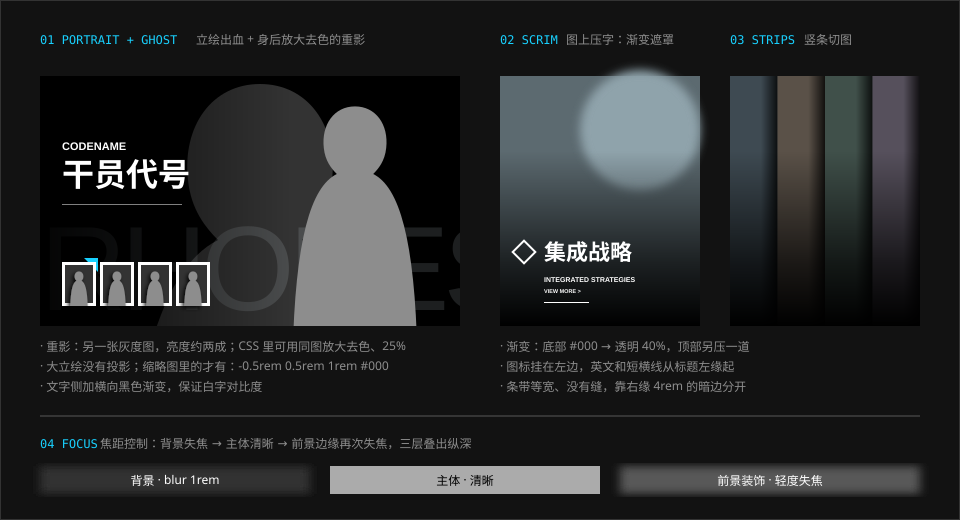

# 图片

> 图是低饱和的、压暗的、出血的。界面不是摆在图片旁边，而是长在图片里面。

## 特征拆解

**1. 立绘出血。** 角色立绘从不被完整地框在一个矩形里。它们越过容器边界，被屏幕边缘或面板切掉一部分——通常是腿部或一侧肩膀。出血让画面显得比屏幕更大。

**2. 幽灵重影。** 官网干员页在立绘身后放了同一张图的放大版：去色、极低不透明度，像一个巨大的影子。主图是彩色的、清晰的，重影是灰的、模糊的，前后拉开了距离。

**3. 背景巨字。** 图片背后或下方压一行巨大的英文（职业名、栏目名、阵营名），颜色只比底色亮一点。字被图片遮住一部分。这行字既是标题，也是纹理。

**4. 渐变遮罩代替整张压暗。** 需要在图片上放文字时，只在文字所在的一侧加黑色到透明的渐变（自下而上或自左而右），图片其余部分保持原样。官网样式表里这类渐变有十余种写法，都是 `#000` 到 `transparent`。

**5. 三层焦距。** 背景失焦，主体清晰，主体之前再放一层轻微失焦的装饰（文字、线条、粒子）。一张平面图因此有了镜头感。分析文章把这称为“前景模糊取镜”（Out of focus foreground framing）。

**6. 晕影与光。** 场景图四周压暗，中心亮度略微溢出。人物有独立的轮廓光。需要强调时在人物身后加一束横向散射光。

**7. 低饱和、偏冷、偏灰。** 场景的色彩被整体压低，带一点烟尘和雾气。这不是为了阴沉，而是为了给 UI 的信号色让路——只有背景足够安静，一小块青蓝才足够醒目。

**8. 条带切图。** 多个入口并排时，每个入口取原图的一条竖带，等宽排列，底部统一压黑。官网“更多内容”一屏是四条竖带。

**9. 等距场景作为导航。** 官网“泰拉万象”一屏用一个等距视角的三维小场景（工作台、显示器、无人机等物件）承载导航，每个物件引出一个标注点。这是把“菜单”做成“场所”。

**10. 加载图也是内容。** 游戏加载时展示完整插画而不是进度条特写，减少等待感。

## 规范

| 项 | 值 | Token | 可信度 |
| --- | --- | --- | --- |
| 立绘投影 | `drop-shadow(-0.5rem 0.5rem 1rem #000)`，向左下 | `--ark-shadow-drop` | 实测 |
| 另见的立绘投影 | `drop-shadow(-1.5rem 1.5rem 0.375rem rgba(0,0,0,.5))` | — | 实测 |
| 背景失焦 | `blur(1rem)` | `--ark-blur-image` | 实测 |
| 压字遮罩（底部） | `linear-gradient(0deg, #000 5rem, transparent 20rem)` 等 | — | 实测 |
| 压字遮罩（侧边） | `linear-gradient(90deg, rgba(0,0,0,.5), transparent)` | `--ark-color-overlay-scrim` | 实测 |
| 混合模式 | 装饰层用 `overlay`；个别反色元素用 `difference` | — | 实测 |
| 幽灵重影 | 放大 2–3 倍、去色、不透明度 5–10% | — | 估计 |
| 背景巨字 | 窄体英文 7rem，`#242424` | `--ark-font-size-ghost` | 实测 |
| 图片比例 | 主视觉 16:9；条带约 1:2.5；缩略图约 3:4 | — | 估计 |
| 饱和度处理 | 场景降低 20–40%，四周压暗 | — | 估计 |

```css
/* 图上压字：只压文字一侧 */
.hero::after {
  content: "";
  position: absolute; inset: 0;
  background: linear-gradient(0deg, #000 5rem, transparent 20rem);
}

/* 幽灵重影 */
.portrait__ghost {
  filter: grayscale(1);
  opacity: 0.07;
  transform: scale(2.4);
}
```

### 裁切约定（估计）

| 图片类型 | 裁切方式 |
| --- | --- |
| 立绘（详情） | 全身，底部出血，头顶留白少 |
| 立绘（卡片） | 胸像，脸在上三分之一 |
| 场景 | 铺满，主体偏离中心，给界面留出一侧 |
| 活动主视觉 | 横幅，标题在左下或正中，人物靠右 |
| 条带入口 | 取原图中脸或关键物件所在的竖带 |

## 示意图



## 图片来源与版权

本仓库不存放任何官方图片。所有官方图片以外链方式引用，汇总在 [官方图片外链索引](../references/image-index.md)。

自己做设计时：

- 使用原创、已获授权或用户自己提供的图片。
- 上面的处理手法（出血、重影、遮罩、三层焦距）与图片内容无关，可以用在任何素材上。
- 不要把提取的游戏立绘、场景、Logo 放进公开项目。多个社区项目在 README 中明确标注了“素材仅供学习、请勿商用”，这是最低限度的做法，不等于获得授权。

## 官方参考

| 看什么 | 链接 | 说明 |
| --- | --- | --- |
| 立绘出血 + 幽灵重影 + 背景巨字 | [官网 · 干员](https://ak.hypergryph.com/#operator) | 三种手法同屏出现 |
| 条带切图 + 底部黑色渐变 | [官网 · 更多内容](https://ak.hypergryph.com/#more) | 四条竖带 |
| 等距场景导航 | [官网 · 泰拉万象](https://ak.hypergryph.com/#media) | 物件 + 标注点 |
| 活动主视觉的横幅构图 | [官网 · 情报](https://ak.hypergryph.com/#information) | 轮播图 |
| 场景图的晕影与雾气 | [首页场景一览 · PRTS](https://prts.wiki/w/%E9%A6%96%E9%A1%B5%E5%9C%BA%E6%99%AF%E4%B8%80%E8%A7%88) | 各主界面场景 |
| 焦距控制的分析 | [UI/UX 分析（GameRes）](https://www.gameres.com/849200.html) | “焦距控制与视觉识别”一节 |

## Do / Don't

| Do | Don't |
| --- | --- |
| 让立绘越过容器边界 | 把立绘完整地装进一个方框 |
| 只在文字一侧加渐变遮罩 | 整张图蒙一层 50% 的黑 |
| 压低背景饱和度 | 背景和 UI 一样鲜艳 |
| 背景巨字只比底色亮一档 | 背景巨字用白色或信号色 |
| 一屏只有一张主图 | 多张等大的图片争抢注意力 |

## 来源

- 官网样式表实测（2026-10-06）
- [《明日方舟》UI/UX 分析——藏在好看背后的先进性](https://www.gameres.com/849200.html)
- [从 TA 的视角看 UI #1](https://zhuanlan.zhihu.com/p/570566718)
- [ak-ui · Design language](https://ak-ui.yyj.moe/en/guide/design-language.html)（原创性边界）
