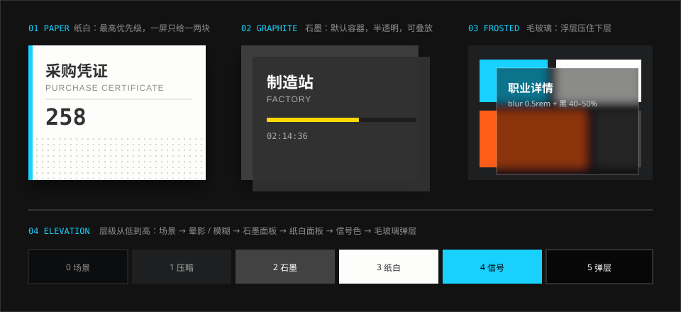

# 布局与层级

> 界面是扁平的，空间不是。固定骨架 + 不对称内容 + 一点透视，让平面读出纵深。

## 特征拆解

**1. 固定骨架，内容在骨架里换。** 官网六屏共用同一副骨架：顶部导航、右侧竖线与计数栏、底部滚动提示、背景幽灵标题。切屏时骨架不动，只换中间的内容。游戏内同理：左上角永远是“返回 + 主页”，右上角永远是资源条。用户不需要重新找路。

**2. 不对称分栏。** 很少见到 1:1 的左右对开。官网情报屏是“窄列表 + 宽图”；干员屏是“左侧文字 + 右侧立绘”；游戏主界面是“左侧助理 + 右侧面板组”。重心偏向一侧，另一侧留给大图或留白。

**3. 靠左对齐，底边压线。** 文字块几乎全部左对齐，从同一条左边线起（官网内容区左起 9rem）。幽灵标题与内容区的底边重叠，像被一条水平线切过。

**4. 层级靠明暗和遮挡，不靠描边。** 自下而上大致六层：场景 → 压暗 / 模糊 → 石墨面板 → 纸白面板 → 信号色 → 毛玻璃弹层。越靠上越亮、越小、越少。

**5. 透视倾斜是“画内界面”的关键。** 游戏主界面的面板组不是正对屏幕，而是像悬浮在场景里的全息投影：左右两组分别绕 Y 轴向内倾斜，并随陀螺仪轻微摆动。社区复刻普遍采用 `perspective(30em) rotateY(±10deg) scale(0.9)`。这种做法在游戏设计里称为 Diegetic Interface（画内界面）——界面被解释为角色也能看到的东西。

**6. 毛玻璃表达“盖在上面”。** 弹层出现时，下层被模糊而不是被完全遮住，用户能看出自己没有离开原来的页面。官网的模糊半径是 `0.5rem`。

**7. 晕影把视线收到中间。** 场景图四周压暗（Vignette），配合面板的明暗，让中心区域成为焦点。

**8. 视差制造远近。** 寻访界面中，不同大小的干员立绘以不同速度位移，配合大小差异形成透视感。

**9. 密度高，但有呼吸口。** 游戏内信息密度很高（一屏十几个入口加若干数值），但每个面板内部留白充足，文字只占面板的左上或左下一角。

## 规范

### 栅格与间距

| 项 | 值 | Token | 可信度 |
| --- | --- | --- | --- |
| 设计基准宽度 | 1920px，根字号 `100vw / 120` 等比缩放 | — | 实测 |
| 内容区左边距 | `9rem`（1280 宽时 96px） | `--ark-space-9` | 实测 |
| 间距阶 | `0.25 / 0.5 / 0.75 / 1 / 1.5 / 2 / 3rem` | `--ark-space-1` … `--ark-space-7` | 社区 / 估计 |
| 新闻行最小高度 | `6rem` | `--ark-space-8` | 社区 |
| 面板间缝隙 | 4–8px | `--ark-space-1`、`--ark-space-2` | 估计 |
| 最小点击区 | 44 × 44px | — | 社区（ak-ui 约定） |

### 透视与深度

| 项 | 值 | Token | 可信度 |
| --- | --- | --- | --- |
| 透视距离 | `30em` | `--ark-depth-perspective` | 社区 |
| 面板组倾角 | `rotateY(±10deg)` | `--ark-depth-tilt` | 社区 |
| 倾斜后缩放 | `0.9` | `--ark-depth-tilt-scale` | 社区 |
| 毛玻璃模糊 | `blur(0.5rem)` | `--ark-blur-backdrop` | 实测 |
| 背景图失焦 | `blur(1rem)` | `--ark-blur-image` | 实测 |
| 面板投影 | `0 1rem 2rem rgba(0,0,0,.32)` | `--ark-shadow-panel` | 社区 |
| 立绘投影 | `drop-shadow(-0.5rem 0.5rem 1rem #000)` | `--ark-shadow-drop` | 实测 |
| 压字遮罩 | `rgba(0,0,0,.5)` | `--ark-color-overlay-scrim` | 实测 |
| 弹层遮罩 | `rgba(0,0,0,.8)` | `--ark-color-overlay-scrim-strong` | 实测 |

```css
/* 主界面右侧面板组：向左后方倾斜（社区实现） */
.panel-group--right {
  transform: perspective(var(--ark-depth-perspective))
             rotateY(calc(-1 * var(--ark-depth-tilt)))
             scale(var(--ark-depth-tilt-scale));
  transform-origin: right center;
}
```

### 响应式

| 项 | 做法 | 可信度 |
| --- | --- | --- |
| 断点依据 | 官网不按宽度分断点，而是按 `(orientation: portrait)` 切换竖屏布局 | 实测 |
| 悬停样式 | 包在 `(any-hover: hover)` 内，触屏设备不触发 | 实测 |
| 竖屏导航 | 收进汉堡菜单，图片堆到列表上方 | 社区 |
| 透视面板 | 窄屏下取消倾斜、改为纵向堆叠，而不是把桌面布局缩小 | 社区（ak-ui 约定） |

## 示意图



主界面的透视结构见 [游戏 · 主界面](../modules/game/home.md)，官网骨架见 [官网](../modules/website.md)。

## 官方参考

| 看什么 | 链接 | 说明 |
| --- | --- | --- |
| 固定骨架 + 换内容 | [官网](https://ak.hypergryph.com/) | 滚动切屏，注意右栏与导航始终不动 |
| 不对称分栏 | [官网 · 干员](https://ak.hypergryph.com/#operator) | 文字靠左、立绘靠右并出血 |
| 透视面板组 | [首页场景一览 · PRTS](https://prts.wiki/w/%E9%A6%96%E9%A1%B5%E5%9C%BA%E6%99%AF%E4%B8%80%E8%A7%88) | 主界面截图中右侧面板的倾斜 |
| 透视的网页复刻 | [mashirozx/arknights-ui · Demo](https://mashirozx.github.io/arknights-ui/) | 可直接看 CSS 3D 的效果 |

## Do / Don't

| Do | Don't |
| --- | --- |
| 先定不动的骨架，再排内容 | 每一屏都重新设计导航位置 |
| 分栏做成不等宽 | 所有区块等分成均匀的卡片墙 |
| 弹层用模糊 + 半透明黑压住下层 | 弹层用纯色实底，切断与下层的联系 |
| 透视只用在一组面板上，角度克制 | 每个元素都加 3D 倾斜 |
| 倾斜后保持矩形点击区 | 让可点区域随视觉变形而错位 |
| 窄屏重新编排 | 把横屏布局整体缩小塞进竖屏 |

## 来源

- 官网样式表实测（2026-10-06）
- [《明日方舟》UI/UX 分析——藏在好看背后的先进性](https://www.gameres.com/849200.html)（Diegetic Interface、类 Fluent Design、晕影、视差）
- [mashirozx/arknights-ui](https://github.com/mashirozx/arknights-ui)（透视参数）
- [ak-ui · Design language](https://ak-ui.yyj.moe/en/guide/design-language.html)（组合规则、触控目标）
