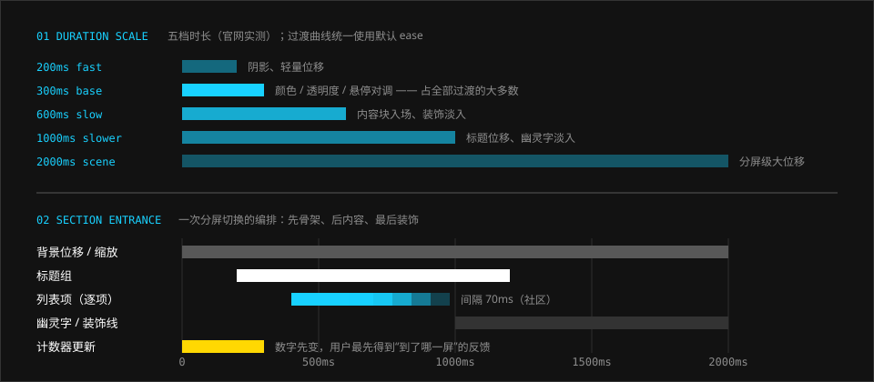

# 动效

> 快、直、有先后。大多数变化在 300ms 内完成，大场面才给到 1–2 秒。

## 特征拆解

**1. 一个默认时长。** 官网样式表中 `0.3s` 是压倒性的多数：颜色、透明度、位移的过渡几乎都是它。用户做一次悬停或点击，得到的反馈时长是一致的。

**2. 五档时长，各有分工。** 200ms（轻量反馈）、300ms（默认）、600ms（内容入场）、1s（标题与幽灵字）、2s（分屏级位移）。时长与元素的“体量”成正比：越大的东西动得越慢。样式表里另有两个孤例：设定条目入场的 0.8s，立绘入场后缓移的 10s。

**3. 悬停 = 前景与背景对调。** 青蓝底黑字的按钮悬停后变成白底黑字；灰底的 READ MORE 悬停后反白。不是变淡或变亮一点，而是整块换色，反馈非常明确。

**4. 入场有编排。** 切换分屏时，各元素不是同时出现：背景先开始位移，标题组随后滑入，列表逐项跟进，幽灵字和装饰线最后淡入。右栏的计数则最先更新，让用户第一时间知道到了哪一屏。

**5. 位移方向有含义。** 同级切换（左右滑动换干员、换轮播）用水平位移；层级深入（进入详情）用 zoom-in；返回用 zoom-out；互不相关的系统之间用简单的深色淡出。

**6. 不离开画布的微交互。** 游戏的干员养成页是典范：升级是横移淡入，升阶是立绘位移，查看天赋是透明浮窗，查看属性是数值向右展开。每一个动作都在同一张画布上完成，立绘始终在场。

**7. 逐帧与机械感。** 光标闪烁用 `step-end`，没有缓动。数字用滚动计数（count-up）而不是淡入。整体倾向是“机器在工作”而不是“东西在飘”。这一条现在是估计：2026-10-08 重读官网样式表，全站只有默认的 `ease`，没有 `step-end`，也没有自定义曲线；加载屏的百分比是脚本写的。

**8. 环境动效很轻。** 主界面有少量烟尘粒子，面板随陀螺仪微微摆动。它们制造氛围，但幅度小到不会干扰阅读。

## 规范

### 时长

| 档位 | 值 | 用途 | Token | 可信度 |
| --- | --- | --- | --- | --- |
| fast | 200ms | 阴影变化、轻量位移、菜单项淡入 | `--ark-motion-duration-fast` | 实测 |
| base | 300ms | 颜色、透明度、悬停对调、指示条移动 | `--ark-motion-duration-base` | 实测 |
| slow | 600ms | 内容块入场、装饰淡入、宽度展开 | `--ark-motion-duration-slow` | 实测 |
| slower | 1000ms | 标题位移、幽灵字淡入、数字滚动 | `--ark-motion-duration-slower` | 实测 |
| scene | 2000ms | 分屏级的大位移与缩放 | `--ark-motion-duration-scene` | 实测 |

全站统计（2026-10-08，只计横屏的规则）：0.3s 出现 121 次，0.6s 34 次，1s 26 次，0.2s 6 次，2s、0.8s 各 2 次，1.5s、10s 各 1 次。

### 缓动

| 名称 | 值 | 说明 | Token | 可信度 |
| --- | --- | --- | --- | --- |
| standard | `ease` | 官网没有自定义曲线，全部使用浏览器默认 | `--ark-motion-easing-standard` | 实测 |
| mechanical | `cubic-bezier(0.2, 0, 0, 1)` | 想要更干脆的起步时使用 | `--ark-motion-easing-mechanical` | 社区 |
| step | `step-end` | 光标闪烁、逐帧切换 | `--ark-motion-easing-step` | 估计（现行样式表里没有） |

### 编排

| 项 | 值 | 可信度 |
| --- | --- | --- |
| 列表逐项间隔 | 70ms：全屏菜单的各项，每项 0.2s，自右 20% 处滑入。200ms：设定屏的条目，每项 0.8s，自左整条滑入 | 实测（写在各项的行内样式里） |
| 入场位移距离 | 最常见的是 `1.5rem`（横竖共 8 处）；另有 `2rem`、`3rem` | 实测 |
| 入场方向 | 文字自左、图片自右、装饰原地淡入 | 估计 |
| 滚动提示 | 1.5s 一轮，`ease`：0–40% 淡入，停到 80%，再下移自身高度的 30% 并淡出。末屏换成向上的箭头，2s 明灭一次 | 实测 |
| 旋转 | 1s 线性（轮播库的预加载指示） | 实测 |
| 立绘缓移 | 入场后 10s 内自左 `3rem` 移回原位，只走一次 | 实测 |
| 骨架横线换位 | 1s | 实测 |

> **2026-10-08 更正。** 逐项间隔的 70ms 原先标的是社区取值，其实官网的全屏菜单就是这个数。滚动提示不是“往复”，是淡入、停住、下移淡出。入场位移原先估的是 1–2rem，样式表里最常见的是 1.5rem。

```css
.btn {
  transition: color var(--ark-motion-duration-base),
              background-color var(--ark-motion-duration-base);
}
@media (any-hover: hover) {
  .btn:hover { background: var(--ark-color-neutral-white); }
}

/* 逐项入场 */
.list > * {
  opacity: 0; transform: translateX(-1.5rem);
  transition: opacity var(--ark-motion-duration-slow),
              transform var(--ark-motion-duration-slow);
  transition-delay: calc(var(--i) * var(--ark-motion-stagger));
}
.list.is-in > * { opacity: 1; transform: none; }
```

### 无障碍

- 尊重 `prefers-reduced-motion`：关闭位移与视差，只保留透明度变化。
- 陀螺仪 / 鼠标驱动的摆动必须可以关闭。
- 故障（Glitch）与闪烁效果不要常驻，持续时间控制在 1 秒内。

## 示意图



## 官方参考

| 看什么 | 链接 | 说明 |
| --- | --- | --- |
| 分屏切换的编排 | [官网](https://ak.hypergryph.com/) | 滚动切屏，注意计数、标题、列表的先后 |
| 悬停对调 | [官网 · 情报](https://ak.hypergryph.com/#information) | 悬停“更多情报”与 READ MORE |
| 条目悬停时浮现的幽灵英文 | [官网 · 设定](https://ak.hypergryph.com/#world) | 悬停任一条目 |
| 3D 摆动的网页实现 | [mashirozx/arknights-ui · Demo](https://mashirozx.github.io/arknights-ui/) | 鼠标 / 陀螺仪驱动 |
| 入场与计数效果的可调演示 | [ak-ui · Components](https://ak-ui.yyj.moe/en/components/) | Effects 一节 |

## Do / Don't

| Do | Don't |
| --- | --- |
| 默认就用 300ms | 每个组件各定一个时长 |
| 悬停时至少改变两项（颜色 + 位置，或底色 + 文字色） | 悬停只变一点透明度 |
| 大元素慢、小元素快 | 所有东西同一速度同时进场 |
| 同级用平移，深入用缩放 | 所有切换都是淡入淡出 |
| 环境动效幅度压到最小 | 持续的大幅度漂浮、发光脉冲 |

## 来源

- 官网样式表实测（2026-10-06）；2026-10-08 把全站的时长、延迟、位移、关键帧（一共只有 7 段）逐条统计了一遍
- [《明日方舟》UI/UX 分析——藏在好看背后的先进性](https://www.gameres.com/849200.html)（过场衔接、养成页微交互）
- [ak-ui · Website coverage & examples](https://ak-ui.yyj.moe/en/guide/official-site-examples.html)（逐项间隔等）
