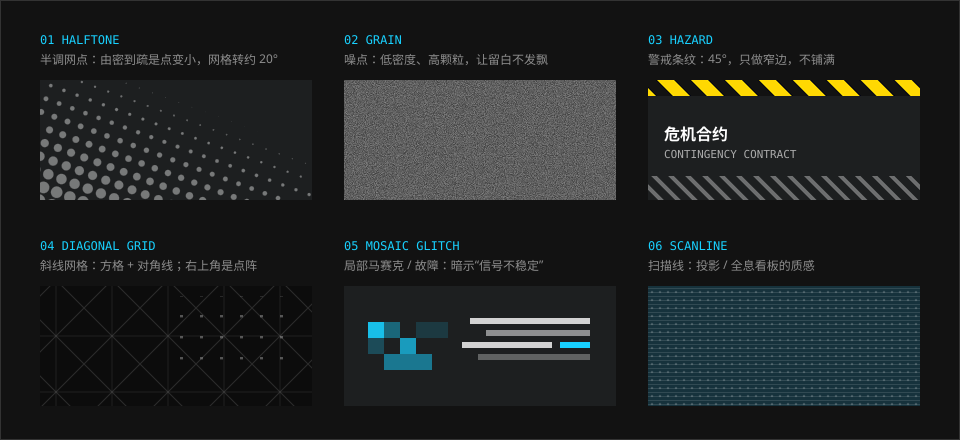

# 底纹

> 平涂的色面上盖一层很轻的颗粒，留白就不会发飘。半调网点和警戒条纹是两张王牌。

## 特征拆解

**1. 半调网点（Halftone）。** 最常见的底纹。一片由密到疏、由大到小的圆点，压在画面的角落或面板的底部。它来自印刷和漫画网点纸，给纯数字的界面带来一点“印出来的东西”的质感。官网每一屏的左下角都有一片网点；游戏内几乎所有浅色面板的下半部分都有。

**2. 噪点（Grain）。** 低密度、高颗粒的散点，铺在按钮和卡片的底色上。作用是让大面积留白不显得单薄，同时提高与上层文字的对比。

**3. 警戒条纹（Hazard stripe）。** 45° 的粗斜条，黄黑相间或同色深浅相间。它是工业现场的警示带，直接点明“危险 / 施工 / 限制”的语境。用法非常克制：只做窄窄的一条边，绝不铺满整个面。

**4. 斜线网格。** 方格加两条对角线，线很细、很暗，铺在最底层。官网背景即是如此。它像图纸的底格，与十字标、角标是同一套语言。

**5. 马赛克与故障（Glitch）。** 局部画面被打成色块，或文字出现横向错位。只在特定时机出现（加载、转场、剧情中的“信号不稳”），暗示玩家是通过某个终端在远程接入这个世界。

**6. 扫描线。** 细密的水平线叠在“投影”性质的面板上，配合透视倾斜，强化全息看板的设定。

**7. 内外统一。** 同样的底纹同时出现在游戏内、官网、宣传图和周边上。底纹本身就是品牌识别的一部分。

## 规范

| 底纹 | 参数 | 用在哪 | 可信度 |
| --- | --- | --- | --- |
| 半调网点 | 圆点直径 2–6px，间距 8–12px，沿一个方向渐疏；白或黑，不透明度 15–45% | 画面角落、浅色面板下半部、图片边缘 | 估计 |
| 噪点 | 单色颗粒，不透明度 10–20% | 按钮、卡片、纯色底图 | 估计 |
| 警戒条纹 | 45°，条宽 6–12px，带高 6–24px | 面板顶边或底边、警告提示、限时活动 | 估计 |
| 斜线网格 | 方格 + 对角线，1px，白 5–15% | 最底层背景 | 估计（结构见官网） |
| 虚线 | 实 0.25rem / 空 0.25rem，`#b2b2b2` | 次级分隔 | 实测 |
| 渐隐细线 | 白 30% → 透明 | 标题下方、行分隔 | 实测 |
| 扫描线 | 1px 线 / 3px 空，白 10% | 全息面板 | 估计 |

```css
/* 虚线分隔（官网实测） */
.rule--dash { height: 1px; background: var(--ark-pattern-dash); }

/* 一端渐隐的细线（官网实测） */
.rule--fade { height: 1px; background: var(--ark-pattern-fade-rule); }

/* 警戒条纹窄边 */
.hazard { height: 0.5rem; background: var(--ark-pattern-hazard); }

/* 半调网点：用遮罩做出由密到疏 */
.halftone {
  background: var(--ark-pattern-halftone);
  mask-image: linear-gradient(to top right, #000, transparent 60%);
}
```

### 叠加顺序

底纹永远在内容之下、底色之上：

1. 底色（平涂）
2. 斜线网格 / 噪点（整面，极淡）
3. 半调网点（局部，角落）
4. 内容（文字、图标、图片）
5. 警戒条纹（贴边，可压在内容层之上）

## 示意图



## 官方参考

| 看什么 | 链接 | 说明 |
| --- | --- | --- |
| 斜线网格 + 左下角半调 | [官网 · 设定](https://ak.hypergryph.com/#world) | 内容少，底纹最清楚 |
| 半调压在场景边缘 | [官网 · 泰拉万象](https://ak.hypergryph.com/#media) | 等距场景四周的网点 |
| 底纹在品牌视觉里的统一使用 | [我在明日方舟里面学平面设计](https://zhuanlan.zhihu.com/p/145684354) | 时装品牌主视觉上的纹理与半调 |
| 散点与粗条纹的分析 | [UI/UX 分析（GameRes）](https://www.gameres.com/849200.html) | “焦距控制与底图处理”一节 |

## Do / Don't

| Do | Don't |
| --- | --- |
| 网点只放一角，并渐隐 | 整面铺满均匀网点 |
| 警戒条纹做成窄边 | 把条纹当大面积背景 |
| 一个面上最多叠两种底纹 | 网点 + 条纹 + 噪点 + 扫描线全上 |
| 底纹的对比度压到“细看才有” | 底纹比文字还抢眼 |
| 故障效果只在转场和特定剧情出现 | 常驻的闪烁与抖动 |

## 来源

- 官网样式表实测（2026-10-06）
- [《明日方舟》UI/UX 分析——藏在好看背后的先进性](https://www.gameres.com/849200.html)
- [从 TA 的视角看 UI #1](https://zhuanlan.zhihu.com/p/570566718)
- [明日方舟 UI 图案以及 LOGO 的设计是什么美术风格？](https://www.zhihu.com/question/489842081)
