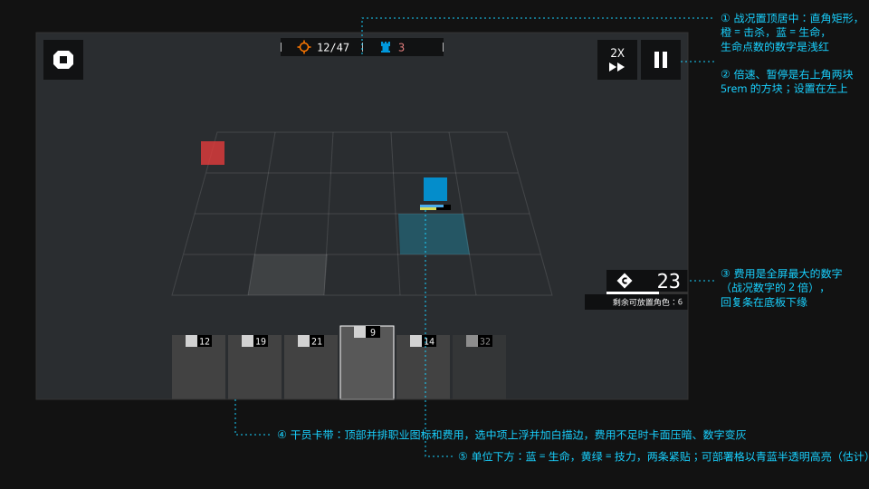

# 游戏 · 作战

> 关卡选择是一张地图，作战界面是一块 HUD。信息贴边，战场留在中间。

> 本篇为观察归纳，数值为估计。

## 关卡选择

- **地图式的节点。** 关卡不是列表，而是一条横向延伸的路线：每个关卡是一个带编号的小方块（`1-7`、`TR-1`），节点之间用细线相连，支线向上下分叉。
- **编号用数据体。** 关卡编号是这一页的主要文字，中文关卡名是副标题。
- **右侧详情面板。** 选中节点后，右侧出现关卡信息：推荐等级、敌方情报、掉落物品，底部是“开始行动”按钮。
- **代价写在按钮上。** 开始行动按钮左侧一块深色区域写着理智消耗（如 `-18`）。
- **章节有各自的主题色与背景。** 不同章节、不同活动的地图背景、配色、标题字体各不相同，但节点、连线、详情面板的结构一致。
- **图纸化的场景。** 关卡地图常用白色体块表示建筑、等高线表示山岭，像一张建筑模型的俯视图。

## 编队

- 干员卡片横向排列，空位是带加号的虚框。
- 卡片沿用干员列表的规则：立绘、职业图标、等级、稀有度条。
- 多个编队用顶部的编号标签切换。

## 作战 HUD

| 区域 | 内容 | 设计要点 |
| --- | --- | --- |
| 顶部居中 | 敌方击杀数 / 总数、我方生命点数 | 红色图标配敌方，蓝色图标配我方；数据体数字 |
| 右上 | 倍速、暂停、设置 | 成组排列，半透明黑底 |
| 底部 | 可部署干员卡带 | 每张卡左上角黑底显示费用；选中项上浮并加描边 |
| 右下 | 当前费用、剩余可部署数 | 费用是全屏最大的数字；上方细条表示费用回复进度 |
| 战场中 | 单位头顶的生命条、技力条；可部署格高亮 | 条很细，直角，贴在单位下方或上方 |

### 状态的表达

| 状态 | 表现 |
| --- | --- |
| 费用不足 | 干员卡面压暗，费用数字转红 |
| 再部署冷却 | 卡面压暗，覆盖倒计时数字 |
| 可部署位置 | 地块以半透明色高亮 |
| 选择朝向 | 干员周围出现菱形方向盘，拖向四个方向之一 |
| 技能就绪 | 单位头顶出现技能图标提示 |
| 敌方进入 | 生命点数减少，屏幕边缘红色闪烁 |

### 代理指挥

代理指挥（自动重放）模式下，界面上下出现遮挡条以示“当前不可操作”。评论文章指出这些遮挡条挡住了画面，玩家看不清战况，也不利于录制分享。表达“只读”状态时，应避免遮挡正在被观看的内容。

## 规范

| 项 | 值 | 可信度 |
| --- | --- | --- |
| HUD 底色 | 黑 50–65% 半透明，直角或单边斜切 | 估计 |
| HUD 数字 | 数据体 Bold | 估计 |
| 费用数字 | 约为其他 HUD 数字的 2.5–3 倍 | 估计 |
| 我方色 | `--ark-color-signal-info-deep` / `--ark-color-tier-3` | 估计 |
| 敌方色 | `--ark-color-signal-danger` | 估计 |
| 生命条 | 高 3–4px，直角，黑色轨道 | 估计 |
| 技力条 | 高 2–3px，位于生命条下方，颜色区别于生命条 | 估计 |
| 可部署高亮 | 信号色 25–30% 填充 | 估计 |
| 关卡节点 | 小矩形 + 数据体编号；已通关 / 当前 / 未解锁三态用明暗区分 | 估计 |
| 节点连线 | 1–2px，已通关为实线、未解锁为暗线 | 估计 |

## 可借鉴的做法

1. **信息贴四边，中间留空。** HUD 元素全部靠边，战场不被遮挡。
2. **最关键的数字最大。** 费用决定下一步能做什么，所以它最大。
3. **状态用明暗 + 颜色 + 数字三重表达。** 费用不足时卡片变暗、数字变红，不需要额外文字。
4. **把列表画成地图。** 关卡之间的先后与分支关系用空间位置表达，比编号列表更直观。
5. **直接操作。** 朝向选择是在干员身上直接拖拽，而不是在别处点方向键。

## 官方参考

| 看什么 | 链接 | 说明 |
| --- | --- | --- |
| 关卡结构与编号 | [关卡一览 · PRTS](https://prts.wiki/w/%E5%85%B3%E5%8D%A1%E4%B8%80%E8%A7%88) | 章节与关卡编号体系 |
| 各活动的地图与主题 | [活动一览 · PRTS](https://prts.wiki/w/%E6%B4%BB%E5%8A%A8%E4%B8%80%E8%A7%88) | 不同活动的视觉差异 |
| 代理作战 UI 的问题 | [《明日方舟》UI/UX 设计复盘](https://www.gcores.com/articles/123154) | “不足 1” |
| 关卡美术与建筑背景 | [从 TA 的视角看 UI #1](https://zhuanlan.zhihu.com/p/570566718) | “游戏场景 / 关卡美术”一节 |

## 来源

- [《明日方舟》UI/UX 设计复盘](https://www.gcores.com/articles/123154)
- [从 TA 的视角看 UI #1](https://zhuanlan.zhihu.com/p/570566718)
- HUD 结构为观察归纳
