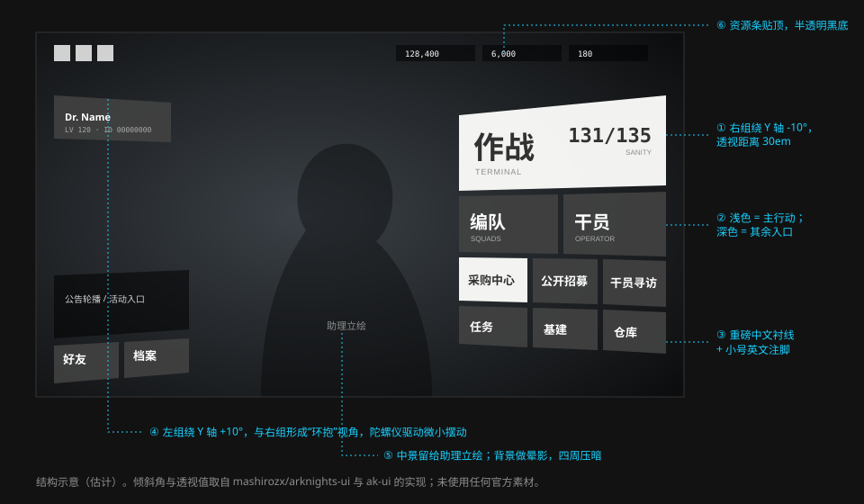

# 游戏 · 主界面

> 主界面不是菜单，是一块悬浮在场景里的全息终端。玩家扮演的“博士”通过它接入罗德岛。

> 本篇关于游戏内界面的描述来自分析文章与社区复刻项目。2026-10-07 对现行界面的实机截图核对了右面板组，改过的地方标「社区（实机截图）」；透视、摆动的数值仍然来自社区复刻。

## 设计意图

主界面采用 **Diegetic Interface（画内界面）** 的思路：界面被解释为游戏世界里真实存在的东西——一套名为 PRTS 的远程终端投射出来的看板。因此它：

- 不是贴在屏幕上，而是带着透视悬浮在场景中；
- 会随设备的陀螺仪轻微摆动；
- 连手机的电量、信号、时间也被收进同一套浮窗风格里；
- 周围有少量烟尘粒子，像真的处在一个空间内。

分析文章把这种做法与《全境封锁》的全息物品栏、《死亡空间》的投影 UI 相提并论：题材上同属近未来科幻，全息投影式的界面与世界观天然契合。

## 结构



| 层 | 内容 |
| --- | --- |
| 场景 | 首页场景（可更换），四周压暗 |
| 助理 | 玩家选定的干员立绘，位于中部偏左，可互动 |
| 左面板组 | 博士信息（等级、ID）、公告轮播、好友、档案等，整体向右后方倾斜 |
| 右面板组 | 主要功能入口，整体向左后方倾斜 |
| 顶部 | 左：设置、邮件、公告等小图标；右：龙门币、合成玉、源石等资源条 |

### 右面板组的编排

右面板组是主界面最有辨识度的部分，由大小不一的矩形错位拼成：

| 行 | 入口 | 面板 | 说明 |
| --- | --- | --- | --- |
| 1 | 终端 | 最大，纸白 | 左边一块显示当前理智（大数字，下面一条黑底写 `理智/135`），右边是入口名和当前进度 |
| 2 | 编队、干员 | 中，纸白 | 两块；“干员”下面一行灰色小字“角色管理” |
| 3 | 采购中心、公开招募、干员寻访 | 小，**蓝** | 三块，白色的入口名居中；后两块上面共用一条写着“招募”的石墨色带 |
| 4 | 任务、基建、仓库 | 小 | 任务和基建是纸白，仓库是石墨 |

- 最重要的入口最大。面积直接对应优先级。
- 每块面板内：入口名是重磅的衬线大字，贴**左上**；下面是一行**同一种语言**的灰色小字（“角色管理”），不是大写的英文注脚。蓝色面板上的入口名居中。
- 面板的底有三种：纸白、石墨、蓝。日间主题下纸白最多。
- 纸白面板上的字没有硬投影。
- 面板之间只留很窄的缝，没有描边。

> **2026-10-07 更正。** 上面这一节原先照的是社区复刻的旧版界面：入口名贴左下、下面是大写的英文注脚（`TERMINAL`、`SQUADS`），第二行是石墨面板，纸白大字带 5px 的灰色硬投影。现行界面（PRTS 的八个主题预览图、英文维基的截图都一致）是上面改过的样子。蓝色面板取色 `#0da1d1`。
- 提醒标记是一个带白边的橙色菱形，骑在面板的角上（实机的“档案”面板）；数量写在面板里的色块上（“基建”面板里的告警数和通知数）。实机上没有圆形的红点。

## 规范

| 项 | 值 | 可信度 |
| --- | --- | --- |
| 透视 | `perspective(30em)` | 社区 |
| 左组倾角 | `rotateY(10deg) scale(0.9)` | 社区 |
| 右组倾角 | `rotateY(-10deg) scale(0.9)` | 社区 |
| 纸白面板 | `#fdfdfb`，文字 `#323232` | 社区；实机取色 `#f3f3f2` 与 `#323232` |
| 石墨面板 | `#424242`，文字 `#ffffff` | 社区；与实机取色一致 |
| 蓝色面板 | `#0da1d1`，白字居中 | 社区（实机截图） |
| 强调色 | 橙 `#ff5e19` | 社区；与实机取色一致 |
| 入口名 | 中文衬线 Heavy（复刻项目用 Noto Serif SC），贴左上 | 社区（实机截图） |
| 入口名下面的小字 | 与入口名同一种语言，灰色黑体，约为入口名的 2/5 | 社区（实机截图） |
| 数值 | 数据体（Bender 或 Novecento） | 社区 |
| 文字硬投影 | `5px 5px 0 #8b8b8b`（大标题）、`0.2rem 0.15rem rgba(0,0,0,.6)` | 社区 |
| 摆动 | 随陀螺仪 / 鼠标位置改变 `rotateX/rotateY`，幅度几度以内 | 社区 |

```css
/* 社区复刻的核心写法（mashirozx/arknights-ui） */
.left  { transform: perspective(30em) rotateY(10deg)  scale(0.9); }
.right { transform: perspective(30em) rotateY(-10deg) scale(0.9); }
```

## 可借鉴的做法

1. **面积即优先级。** 不需要“推荐”角标，最大的那块就是该点的。
2. **三种面板拼在一起。** 纸白、石墨和一行蓝色，比统一底色更容易分辨区域；彩色只给一行。
3. **透视只做一层。** 只有面板组整体倾斜，面板内部的文字和图标保持正交关系，不再二次变形。
4. **场景可以换，结构不动。** 首页场景、助理、界面主题都能更换，但面板的位置与大小始终如一。见 [界面主题](themes.md)。
5. **设备信息入戏。** 把时间、电量这类系统信息用同一套视觉语言重画，沉浸感来自这种细节。

## 设计时的注意点

- 透视面板在网页上要保证点击区仍是矩形，且文字不因变形而模糊（必要时对文字层单独处理）。
- 陀螺仪 / 鼠标摆动必须可以关闭，并遵循 `prefers-reduced-motion`。
- 窄屏下取消透视，面板改为纵向堆叠。
- 一条评论指出：把 UI 布局框得这么死，做多语言本地化时文字长度的适配会比较吃力。固定尺寸的面板需要为较长的译文预留方案（缩字、换行或缩写）。

## 官方参考

| 看什么 | 链接 | 说明 |
| --- | --- | --- |
| 各首页场景下的主界面 | [首页场景一览 · PRTS](https://prts.wiki/w/%E9%A6%96%E9%A1%B5%E5%9C%BA%E6%99%AF%E4%B8%80%E8%A7%88) | 场景预览 |
| 主界面 UI 主题 | [Home Screen/UI · Arknights Terra Wiki](https://arknights.wiki.gg/wiki/Home_Screen/UI) | 英文维基的主题列表与图片 |
| 现行主界面的实机截图 | [界面主题一览 · PRTS](https://prts.wiki/w/%E7%95%8C%E9%9D%A2%E4%B8%BB%E9%A2%98%E4%B8%80%E8%A7%88) | 1280 × 720，每个主题一张，可以取色 |
| H5 复刻（可交互） | [mashirozx/arknights-ui · Demo](https://mashirozx.github.io/arknights-ui/) | 鼠标 / 陀螺仪驱动的透视 |
| React 复刻模板 | [Cromemadnd/ArknightsUI-React-Template](https://github.com/Cromemadnd/ArknightsUI-React-Template) | 3D 变换、设置面板 |
| 画内界面的分析 | [UI/UX 分析（GameRes）](https://www.gameres.com/849200.html) | “Diegetic Interface 风格与沉浸感”一节 |

## 来源

- [《明日方舟》UI/UX 分析——藏在好看背后的先进性](https://www.gameres.com/849200.html)
- [从 TA 的视角看 UI #1](https://zhuanlan.zhihu.com/p/570566718)
- [mashirozx/arknights-ui](https://github.com/mashirozx/arknights-ui)、[YunYouJun/ak-ui](https://github.com/YunYouJun/ak-ui)、[Cromemadnd/ArknightsUI-React-Template](https://github.com/Cromemadnd/ArknightsUI-React-Template)
- [明日方舟 UI 图案以及 LOGO 的设计是什么美术风格？](https://www.zhihu.com/question/489842081)
