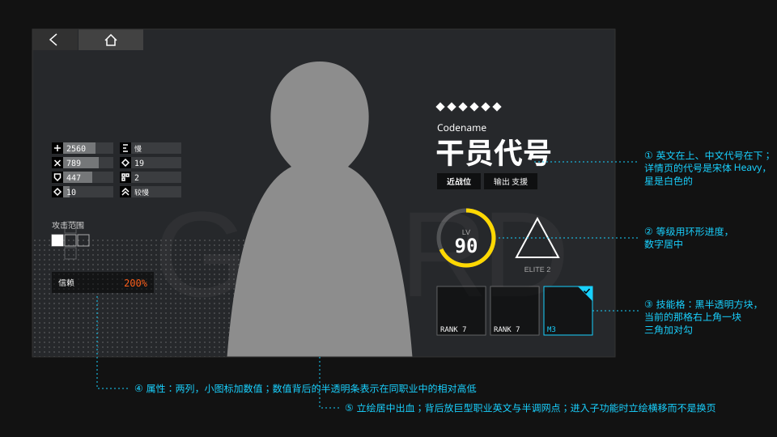

# 游戏 · 干员

> 干员页像一份档案。所有养成操作都在同一张画布上完成，立绘从不离场。

> 本篇原先是观察归纳。2026-10-07 对实机截图核对了干员卡片、属性表、技能格和筛选栏，改过的地方标「社区（实机截图）」。

## 干员列表

- **竖长卡片网格。** 每张卡片是一张胸像立绘，脸在上三分之一。横向滚动。
- **左上是职业图标，星级紧跟在它后面。** 职业图标压在一块黑底方块上；星是黄色的，一颗压一颗，从图标右边排开，不是钉在右上角。
- **下面一条近黑色的带，上缘左高右低。** 落差约为卡片宽度的五分之一。等级写在带子左边的一个圆里：黑色圆底、一圈黄环，`LV` 小字在数字上方；圆的上方是精英化的徽记。代号在带子的右下，右对齐。
- **稀有度靠星数和光晕的颜色。** 名字带上方垫一片稀有度色的光：六星是一片橙黄的半调网点，低星是一片平滑的色晕。卡片底边没有一整条色条，只有左下角一小段稀有度色的箭头纹。
- **卡片下半部没有黑色渐变。** 白字压在那条近黑色的带上，不靠渐变。
- **排序栏在顶部，职业筛选贴在右边。** 顶部一条深色带放排序方式，当前的那一项是蓝字，下面一个蓝色的小折角；职业筛选是贴着右边的一竖列，只有图标，每格约 50px 见方。旧版的筛选弹层是一张纸白的浮层，选项是深色的文字块，选中的换成蓝色实底。

## 干员详情

| 区域 | 内容 | 排版 |
| --- | --- | --- |
| 中央 | 立绘 | 全身，底部出血；背后是巨型职业英文与半调网点 |
| 左侧 | 属性、攻击范围、信赖 | 属性排成两列，每项是“黑底白色的小图标 + 数值”，没有文字标签；数值背后一条与图标等高的半透明条表示相对值 |
| 左下 | 星级、英文名、中文代号、职业与定位标签 | 一排白色的星；英文名大小写混排、细黑体；中文代号是宋体 Heavy，很大 |
| 右上 | 等级环、精英化图标、潜能 | 黄色的环，`LV` 在数字上方 |
| 右中 | 技能、模组 | 方格并排；当前装备的那一个右上角一块蓝色三角，里面一个白色对勾 |
| 左上 | 返回 + 主页 | 全局固定 |

### “简历”式的信息编排

官方的干员介绍图（玩家俗称“发饼”图）被形容为一份简历，与“应聘进入罗德岛成为干员”的设定呼应。其排版约定自开服以来保持一致（社区整理）：

| 元素 | 字体 | 字重 | 字距 | 对齐 |
| --- | --- | --- | --- | --- |
| 干员代号 | 思源黑体 | Heavy | -100 | 左 |
| 简略信息 | 思源黑体 / 宋体 | Normal | -100 | 左右结构 |
| 技能介绍 | 思源黑体 / 宋体 | Normal | 0 | 左对齐到技能图标右侧 |

配色上大量使用黑白灰和克制的低饱和色，只用一个亮色点出重点。分析文章将其与机能风（Techwear）服装设计、建筑制图的用色习惯联系起来：黑白灰打底，亮色只标重点。

## 养成：不离开画布

干员详情页最被称道的是它的微交互设计。每个按钮都不把玩家带到一个全新页面，而是在原画布上做局部变化：

| 操作 | 界面变化 |
| --- | --- |
| 升级 | 面板横移并淡入 |
| 精英化（升阶） | 立绘位移，让出空间 |
| 提升潜能 | 立绘位移 |
| 升级技能 | 背景不变，前景替换 |
| 查看天赋 | 弹出透明浮窗 |
| 查看职业详情 | 弹出毛玻璃弹窗 |
| 查看属性详情 | 数值向右展开 |
| 查看档案 | 立绘位移 |
| 查看时装 | 弹出毛玻璃弹窗 |
| 切换干员 | 左右拖拽，直接换人 |

效果是：在一个相当复杂的养成系统里，玩家始终没有“进入了另一个页面”的感觉。

## 规范

| 项 | 值 | 可信度 |
| --- | --- | --- |
| 干员介绍图、卡片上的代号 | 思源黑体 Heavy，字距 `--ark-font-tracking-cjk-tight` | 社区 |
| 详情页的中文代号 | 宋体 Heavy，不收字距 | 社区（实机截图） |
| 详情页的英文名 | 大小写混排，细黑体，字号约为中文的 1/3 | 社区（实机截图） |
| 官网干员页中文名 | 思源黑体 Bold，`3.75rem` | 实测 |
| 官网干员页英文名 | Novecento Sans Wide Bold，`1.25rem` | 实测 |
| 属性的图标 | 黑底白色图形的小方块，折到 1280 宽约 `1.2rem` | 社区（实机截图） |
| 属性数值 | 常规字重，左对齐，紧跟在图标后面 | 社区（实机截图） |
| 属性的相对值 | 数值背后一条与图标等高的半透明条，底下一条更浅的轨道 | 社区（实机截图） |
| 星级色 | `--ark-color-tier-star`；详情页是白色 | 社区（实机截图） |
| 等级环 | 黑色圆底，一圈黄环，`LV` 在数字上方 | 社区（实机截图） |
| 卡片的名字带 | 近黑色，上缘左高右低，落差约为卡宽的 1/5；代号右对齐 | 社区（实机截图） |
| 卡片的稀有度光晕 | 名字带上方一片稀有度色，六星是半调网点 | 社区（实机截图） |
| 技能格的当前项 | 右上角一块蓝色三角加白色对勾 | 社区（实机截图） |
| 技能格的描边 | `1px` 白 30%；选中换信号色 | 估计 |
| 职业筛选 | 贴右的一竖列，只有图标，每格约 50px；筛选中的标记是蓝色 | 社区（实机截图） |
| 立绘背后巨字 | 窄体英文，白 3–6% | 估计 |

> **2026-10-07 更正。** 原先写的几条与实机不符：星级在卡片右上（实机紧跟在左上的职业图标后面）；等级是一行字（实机是一个圆环）；卡片下半压黑色渐变、底边一条稀有度色条（实机是一条斜切的近黑色带，稀有度靠带子上方的光晕）；属性是“标签在左、数值右对齐、下方 2px 细条”（实机是图标加数值，条垫在数值背后）；技能格选中是信号色描边（实机是右上角的蓝色三角加对勾）；筛选栏的职业图标在顶部（实机在右边竖排）；详情页的代号是黑体（实机是宋体）。

## 可借鉴的做法

1. **主体常驻。** 无论做什么操作，立绘都在。详情页的“主语”不变，用户不会迷路。
2. **用位移代替跳转。** 让出空间比换一页更轻。
3. **同级切换用手势。** 左右滑动换干员，省去“返回列表 → 再点一个”的往返。
4. **排版约定长期不变。** 字体、字重、字距的规则多年如一，是品牌感的来源。

## 可改进之处

评论文章指出：详情页左侧的属性、信赖值、攻击范围等其实可以点击查看详情，但样式与普通文字没有区别，可交互区域不明显。设计时应给可点击元素一个可见的线索。

## 官方参考

| 看什么 | 链接 | 说明 |
| --- | --- | --- |
| 官网的干员展示 | [官网 · 干员](https://ak.hypergryph.com/#operator) | 立绘 + 重影 + 名称排版 |
| 干员卡片与筛选 | [干员一览 · PRTS](https://prts.wiki/w/%E5%B9%B2%E5%91%98%E4%B8%80%E8%A7%88) | 职业、稀有度的编码 |
| 干员列表、筛选弹层的整屏截图 | [Arknights Terra Wiki 的 `UI-opmenu`、`UI-opfilter`](https://arknights.wiki.gg/wiki/File:UI-opmenu.jpg) | 卡片四角的信息、右侧的职业栏 |
| 干员详情页的整屏截图 | [《明日方舟》UI/UX 设计复盘](https://www.gcores.com/articles/123154) | 属性表、技能格、代号的排版 |
| 养成页微交互的分析 | [UI/UX 分析（GameRes）](https://www.gameres.com/849200.html) | “过场衔接技巧与系统结构”一节 |
| 干员信息排版约定 | [从 TA 的视角看 UI #1](https://zhuanlan.zhihu.com/p/570566718) | “人物简介”一节 |

## 来源

- [《明日方舟》UI/UX 分析——藏在好看背后的先进性](https://www.gameres.com/849200.html)
- [从 TA 的视角看 UI #1](https://zhuanlan.zhihu.com/p/570566718)
- [《明日方舟》UI/UX 设计复盘](https://www.gcores.com/articles/123154)
- 官网干员页实测（2026-10-06）
- 实机截图核对（2026-10-07）：机核文章里的干员列表与干员详情截图、Arknights Terra Wiki 的干员列表与编队截图、MAA 的模板图
