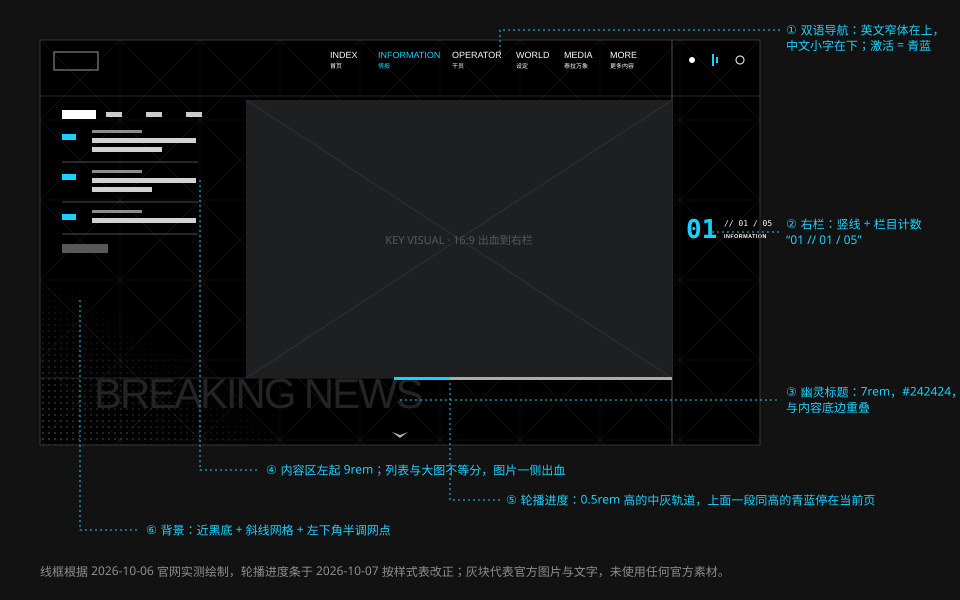

# 官网

> 一个固定骨架，六屏内容。黑底、单一青蓝、双语标签、背景巨字——整套设计语言最干净的一次呈现。

实测对象：[ak.hypergryph.com](https://ak.hypergryph.com/)，2026-10-06，视口 1280 × 720。

## 结构

官网是一个纵向分屏的单页，六屏通过锚点切换：

| # | 锚点 | 英文 | 中文 | 内容 |
| --- | --- | --- | --- | --- |
| 00 | `#index` | INDEX | 首页 | 主视觉、下载入口 |
| 01 | `#information` | INFORMATION | 情报 | 新闻列表 + 活动轮播 |
| 02 | `#operator` | OPERATOR | 干员 | 干员立绘、简介、缩略图切换 |
| 03 | `#world` | WORLD | 设定 | 世界观名词条目 |
| 04 | `#media` | MEDIA | 泰拉万象 | 等距场景导航：画廊、音乐、干员、视频 |
| 05 | `#more` | MORE | 更多内容 | 集成战略、生息演算、衍生动画、泰拉记事社 |

### 固定骨架

| 区域 | 位置 | 内容 |
| --- | --- | --- |
| 顶栏 | 顶部通栏 | 左：Logo；中右：六个双语导航项；最右：分享、音频、账号图标 |
| 右栏 | 右侧窄列，左缘一条竖线 | 栏目计数 `01 // 01 / 05` + 栏目英文名；下载与社交入口 |
| 幽灵标题 | 内容区左下 | 本屏英文名的巨字（BREAKING NEWS、WORLD、ABOUT TERRA、MORE CONTENT） |
| 滚动提示 | 底部居中 | 向下的小箭头 |
| 背景 | 全屏 | 纯黑 + 斜线网格 + 左下角半调网点 |

骨架在切屏时不动，只有导航高亮、计数数字和幽灵标题随屏更新。

## 各屏拆解

### 首页 INDEX

- 全屏主视觉，人物偏右，被一块巨大的青蓝色块和巨型字母部分遮挡——色块与人物互相穿插，形成前后关系。
- 左下角是品牌字 `ARKNIGHTS`（Novecento Sans Wide UltraBold，5.5rem），旁边跟一行小字 `RHODES ISLAND` 与网址。
- 右栏堆叠下载入口，每个是一条窄的色块按钮。

### 情报 INFORMATION

- 左侧窄列是新闻：顶部四个分类标签（当前项反白），下面三行新闻，每行“分类 / 日期 / 标题”。
- 右侧宽区是活动轮播，16:9（`83.125rem × 46.875rem`），右边出血到右栏竖线，左缘 20% 渐隐。下方一条 `0.5rem` 高的进度条：青蓝段表示当前，灰色为轨道。轮播上没有翻页按钮，也没有自己的计数。
- 左下一个青蓝主按钮“更多情报 / READ MORE”。
- 这一屏最能说明“不对称分栏”：列表很窄，图很宽。

### 干员 OPERATOR

- 左侧文字区：小标签 `PROFILE`（上面一行更小的 `RHODES ISLAND ://`）、英文名（小）、中文名（3.75rem 粗黑）、阵营三角徽记、声优信息、简介段落（**不透明**的黑底）。
- 右侧立绘出血，身后是同一张图的放大去色重影。
- 左下一排缩略图（现在是六张）：每张一圈白框，名字写在左下角；当前项从**右上角后面探出一块青蓝的三角**，其余的不压暗。
- 背景巨字是阵营或 `RHODES`。

干员屏的取值（样式表实测，2026-10-07）：

| 位置 | 取值 |
| --- | --- |
| 小标签 | `RHODES ISLAND ://` Oswald Medium `0.875rem`；`PROFILE` Oswald Medium `1.5rem`，上距 `0.5rem` |
| 徽记 | 高 `5rem`，左距 `1.5rem`，与名字底对齐 |
| 声优 | 标签 `CHARACTER VOICE` Oswald Medium `0.75rem`、青蓝；名字 `0.875rem`，一行黑底白字、一行白底灰字 |
| 简介 | 宽 `33.625rem`，内边距 `0.875rem 3.75rem 1.125rem`，底色 `#000`，`1.125rem`、行高 1.4、`#ababab` |
| 缩略图 | `7.125rem × 11.25rem`，一圈 `0.625rem` 的白框，图片向左下投影 |
| 缩略图的名字 | 思源黑体 Medium `1rem`，左 `0.375rem`、下 `0.75rem`，上方一个 `0.375rem` 的方点，四周一圈黑色的晕 |
| 当前项的标记 | 直角边 `2rem` 的青蓝三角，垫在缩略图后面，向上探出 `0.5rem`、向右探出 `0.375rem`；切换时闪一下白 |

> **2026-10-07 更正。** 原先写“左下四张缩略图，当前项上方一条青蓝短条”“简介段落半透明黑底”。读样式表后：标记是右上角的三角，不是短条；简介的底是不透明的黑。

### 设定 WORLD

- 六个名词条目纵向排列，每条是“中文粗黑（2.5rem）+ 英文（1.25rem 宽体）”，两者在**同一行**，下方一条 1px 的实白线。
- 各条**左缘对齐**。入场时逐条自左滑入，每条比前一条晚 200ms——滑到一半时看上去像一道阶梯。
- 文字默认是灰的（`#ababab`）。悬停某一条时，文字变**白**并向右位移 `2rem`，背后贴着右端浮现一行 25% 青蓝的巨型英文（`4.5rem`）。
- 这是内容最少的一屏，背景的斜线网格在这里最清楚。

设定屏的取值（样式表实测，2026-10-07）：

| 位置 | 取值 |
| --- | --- |
| 列表 | 左 `9rem`，宽 `39.875rem` |
| 条目 | 高 `6rem`，内容贴底，下内边距 `0.75rem`，底线 `1px solid #fff` |
| 中文 | 思源黑体 Bold `2.5rem`，`#ababab` |
| 英文 | Novecento Sans Wide Bold `1.25rem`，左距 `1.5rem`，`#ababab` |
| 悬停 | 两行字都变 `#fff`，`translateX(2rem)`，0.3s |
| 巨字 | Novecento Sans Wide Bold `4.5rem`，`rgba(24, 209, 255, 0.25)`，右 `0.75rem`、下 `0.75rem`，0.3s 淡入 |
| 入场 | `translateX(-100%)` 到 0 加淡入，0.8s，每条延迟递增 200ms |

> **2026-10-07 更正。** 原先写“条目的左缩进逐条变化，形成阶梯状”“英文小字在中文下面”“悬停时文字变色”。样式表里没有缩进，阶梯是入场动画的中间帧；英文和中文在同一行；悬停是从灰变白，不是变成青蓝。

### 泰拉万象 MEDIA

- 中央是一组等距视角的三维物件（工作台、显示器、无人机、收纳箱），四个标注点分别引出 GALLERY、MONSTER SIREN、OPERATOR、VIDEO。
- 左侧是标题组 `ABOUT TERRA` / `泰拉万象`，下方一条青蓝短线，再下是简介与网址。
- 导航被做成了一个“场所”，而不是一排按钮。

### 更多内容 MORE

- 四条等宽竖带，各取一张插画的局部。
- 每条底部：图标 + 中文粗标题 + 英文小标签 + `VIEW MORE >` + 一条短横线。
- 底部统一压黑色渐变。

## 规范（实测）

### 字体

| 位置 | 字体 | 字号 |
| --- | --- | --- |
| 导航英文 | Oswald Medium | 1.375rem |
| 导航中文 | 思源黑体 Medium | 0.875rem |
| 品牌字 | Novecento Sans Wide UltraBold | 5.5rem |
| 幽灵标题 | Oswald Medium，字距 -0.05em | 7rem |
| 屏标题（英） | Novecento Sans Wide Bold | 3.125rem |
| 屏标题（中） | 思源黑体 Bold | 3.75rem |
| 条目标题 | 思源黑体 Bold | 2.5rem |
| 小节标签 | Oswald Medium | 1.5rem |
| 按钮中文 | 思源黑体 Bold | 1.25rem |
| 按钮英文 / READ MORE | Bender Bold | 0.875rem |
| 日期 | Bender Regular，字距 1px | 1rem |
| 标注标签 | Oswald Medium | 1.25rem |

### 颜色

| 用途 | 值 |
| --- | --- |
| 底色 | `#000000` |
| 主文字 | `#ffffff` |
| 次要文字 | `#d2d2d2`、`#ababab` |
| 信号色 | `#18d1ff`（样式表中出现 40 余次，是唯一高频彩色） |
| 幽灵标题 | `#242424` |
| 弱按钮底 | `#585858` |
| 细线 | `hsla(0,0%,100%,.3)`、`hsla(0,0%,100%,.5)` |
| 面板 | `#1d1f20`、`#272727`、`#292929` |

### 动效

| 项 | 值 |
| --- | --- |
| 默认过渡 | `0.3s`，曲线为默认 `ease` |
| 内容入场 | `0.6s` |
| 标题 / 幽灵字 | `1s` |
| 分屏位移 | `2s` |
| 悬停 | 包在 `(any-hover: hover)` 内；`color` 与 `background-color` 同时过渡 |

### 响应式

| 项 | 做法 |
| --- | --- |
| 缩放 | 根字号 `100vw / 120`，所有尺寸用 rem，整体等比缩放 |
| 断点 | 以 `(orientation: portrait)` 为主要切换条件（样式表中 300 余条规则） |
| 竖屏 | 导航收进全屏菜单；图片堆到列表上方；新闻行的日期移到右侧 |

## 可借鉴的做法

1. **骨架与内容分离。** 导航、计数、幽灵标题构成一个不动的框，换屏只换内容。
2. **每屏一个主角。** 首页是主视觉，情报是轮播，干员是立绘，设定是文字，泰拉万象是场景，更多内容是四条带。没有哪一屏同时强调两样东西。
3. **标题写三遍。** 栏目名同时出现在导航（小）、右栏计数（中）、幽灵标题（巨）。三个尺寸、三个位置，既是导航又是装饰。
4. **整站等比缩放。** 用 rem + 视口相关的根字号，让版式在不同分辨率下保持比例；竖屏另起一套布局。
5. **只用一个彩色。**

## 可改进之处

第三方的改版练习指出过旧版官网的一些问题，其中部分在现版已经解决，仍可作为设计时的检查项：

- 导航默认隐藏、需要额外点击才能看到 → 现版已常驻顶部。
- 下载入口占用过多首屏空间。
- 干员页一次展示的阵营与角色偏少，切换层级偏深。
- 设定页容纳内容有限，延展性不足。
- 幽灵标题的对比度很低（`#242424` 对 `#000000`），只能作为装饰，不能作为唯一的标题。

## 官方参考

| 看什么 | 链接 |
| --- | --- |
| 六屏 | [首页](https://ak.hypergryph.com/#index) · [情报](https://ak.hypergryph.com/#information) · [干员](https://ak.hypergryph.com/#operator) · [设定](https://ak.hypergryph.com/#world) · [泰拉万象](https://ak.hypergryph.com/#media) · [更多内容](https://ak.hypergryph.com/#more) |
| 第三方对官网 UI 的逐项测量 | [ak-ui · Official website UI study](https://ak-ui.yyj.moe/en/guide/official-site-study.html) |
| 基于官网模式的独立实现 | [ak-ui · Website showcase](https://ak-ui.yyj.moe/en/showcase/website.html) |
| 第三方改版练习 | [尝试优化《明日方舟》官方网站的设计](https://www.gcores.com/articles/135723) |

## 来源

- 官网样式表与计算样式实测（2026-10-06）；干员屏、设定屏、轮播的取值重读于 2026-10-07
- [ak-ui · Official website UI study](https://ak-ui.yyj.moe/en/guide/official-site-study.html)、[Website coverage & examples](https://ak-ui.yyj.moe/en/guide/official-site-examples.html)
- [尝试优化《明日方舟》官方网站的设计](https://www.gcores.com/articles/135723)
